# Alacritty Theme

Collection of colorschemes for easy configuration of the [Alacritty terminal
emulator].

[Alacritty terminal emulator]: https://github.com/alacritty/alacritty

## Installation

### Imports

Clone the repository, or download the theme of your choice:

```sh
# We use Alacritty's default Linux config directory as our storage location here.
mkdir -p ~/.config/alacritty/themes
git clone https://github.com/alacritty/alacritty-theme ~/.config/alacritty/themes
```

Add an import to your `alacritty.toml` (Replace `{theme}` with your desired
colorscheme):

```toml
[general]
import = [
    "~/.config/alacritty/themes/themes/{theme}.toml"
]
```

### Manual

To manually include a colorscheme in an existing `alacritty.toml`, you just need
to copy the entire content of the theme into the root level of your
configuration file.

## Color Schemes

|                                                                       NAME                                                                        |                           COLORS                           |
|:-------------------------------------------------------------------------------------------------------------------------------------------------:|:----------------------------------------------------------:|
|                                   **_acme_**<br>[source](https://github.com/plan9-for-vimspace/acme-colors)                                       |             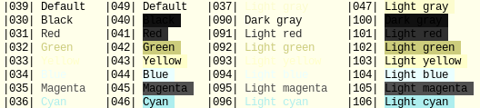
|                                   **_afterglow_**<br>[source](https://github.com/YabataDesign/afterglow-theme)                                    |                |
|                                   **_alabaster_**<br>[source](https://github.com/tonsky/vscode-theme-alabaster)                                   |             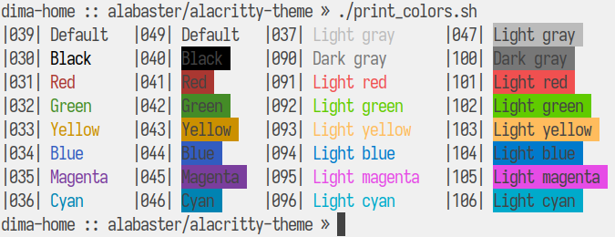             |
|                                   **_alabaster_dark_**<br>[source](https://github.com/gargakshit/vscode-theme-alabaster-dark)                     |                |
|                **_alacritty_0_12_**<br>[source](https://github.com/alacritty/alacritty/blob/v0.12.3/alacritty/src/config/color.rs)                |        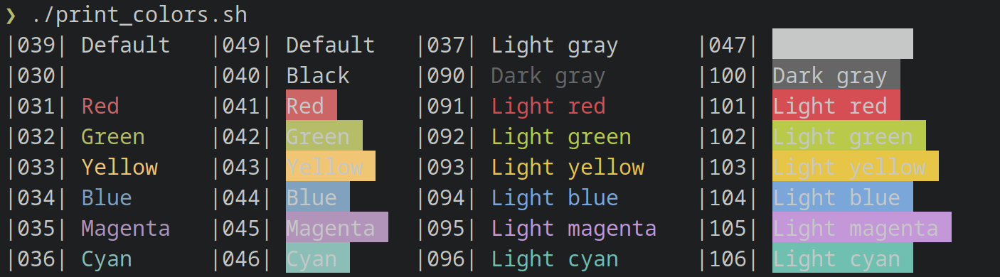        |
|                                      **_argonaut_**<br>[source](https://github.com/pwaleczek/Argonaut-theme)                                      |                 |
|             **_ashes_dark_**<br>[source](https://marketplace.visualstudio.com/items?itemName=AndrsDC.base16-themes)                               |        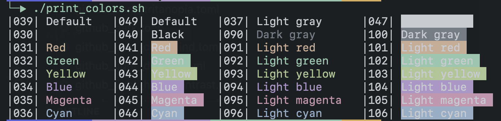         |
|             **_ashes_light_**<br>[source](https://marketplace.visualstudio.com/items?itemName=AndrsDC.base16-themes)                              |        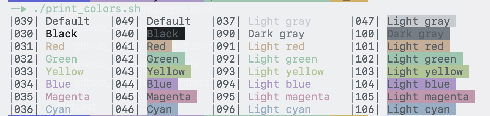       |
|                  **_aura_**<br>[source](https://github.com/daltonmenezes/aura-theme)                   |        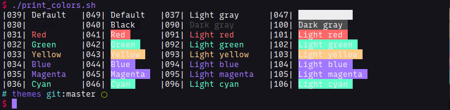        |
|                  **_autumn_**<br>[source](https://github.com/YorickPeterse/Autumn.vim)                                                            |              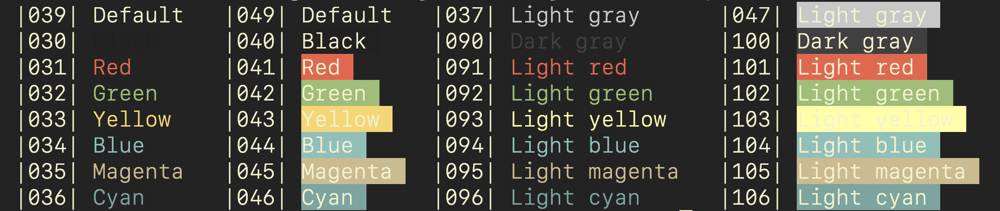                  |
|                                        **_ayu_dark_**<br>[source](https://github.com/ayu-theme/ayu-colors)                                        |                            |
|                                       **_ayu_light_**<br>[source](https://github.com/ayu-theme/ayu-colors)                                        |                          |
|                                       **_ayu_mirage_**<br>[source](https://github.com/ayu-theme/ayu-colors)                                        |             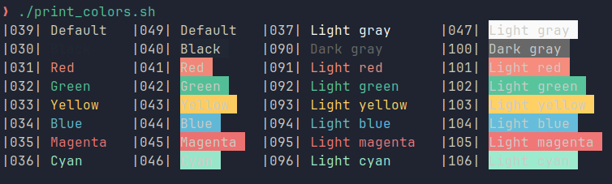             |
|                                   **_baitong_**<br>[source](https://github.com/cypj/baitong-theme)                                                |         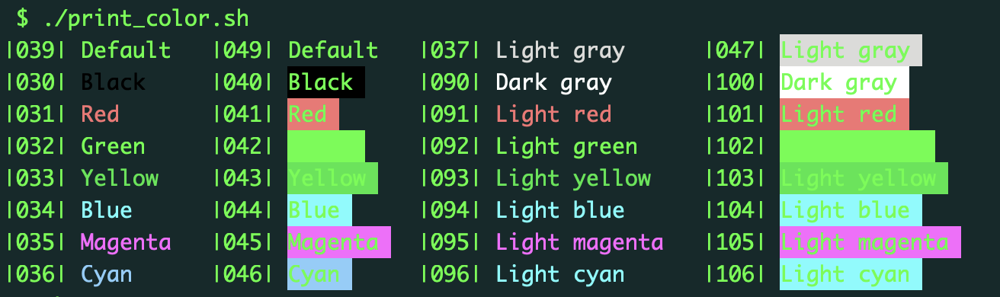                     |
|                                   **_base16_default_dark_**<br>[source](https://github.com/chriskempson/base16)                                   |      |
|                                         **_blood_moon_**<br>[source](https://github.com/dguo/blood-moon)                                          |                        |
|                                                                   **_bluish_**                                                                    |                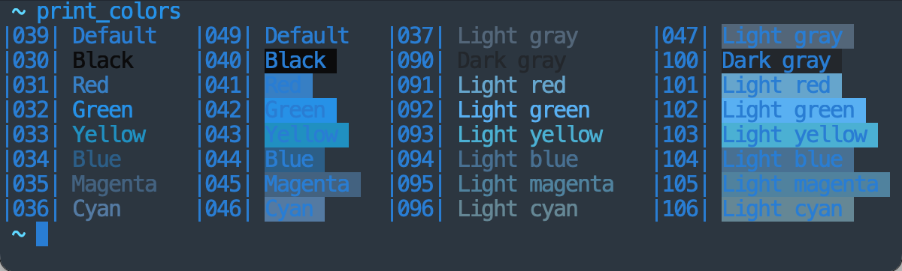                |
|                                              **_breeze_**<br>[source](https://github.com/KDE/breeze)                                              |                                |
|              **_campbell_**<br>[source](https://blogs.msdn.microsoft.com/commandline/2017/08/02/updating-the-windows-console-colors)              |                            |
|              **_carbonfox_**<br>[source](https://github.com/EdenEast/nightfox.nvim/blob/7557f26defd093c4e9bc17f28b08403f706f5a44/extra/carbonfox/alacritty.toml)               |             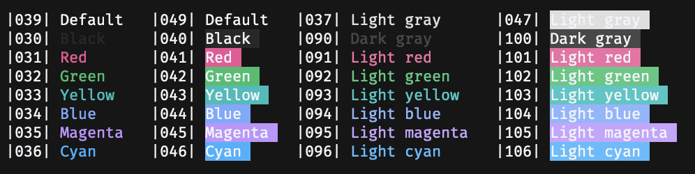             |
|                                    **_catppuccin_frappe_**<br>[source](https://github.com/catppuccin/alacritty)                                   |     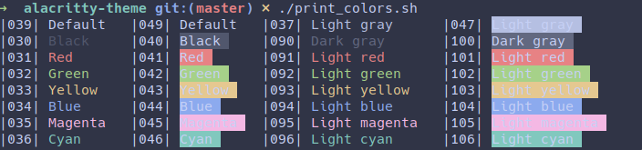     |
|                                 **_catppuccin_latte_**<br>[source](https://github.com/catppuccin/alacritty)                                       |      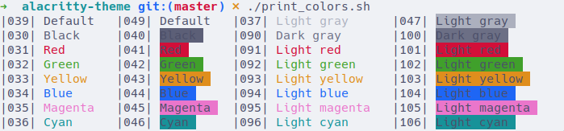      |
|                                  **_catppuccin_macchiato_**<br>[source](https://github.com/catppuccin/alacritty)                                  |  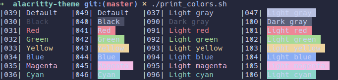  |
|                                    **_catppuccin_mocha_**<br>[source](https://github.com/catppuccin/alacritty)                                    |      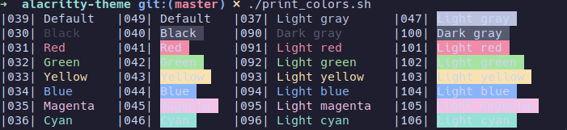      |
|                               **_challenger_deep_**<br>[source](https://github.com/challenger-deep-theme/alacritty)                               |              |
|                                                                  **_chicago95_**                                                                  |               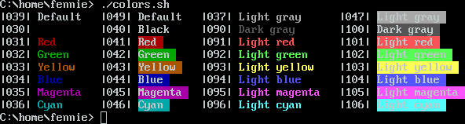           |
|                                              **_citylights_**<br>[source](https://citylights.xyz/)                                               |                       |
|                                 **_Cobalt2_**<br>[source](https://github.com/wesbos/cobalt2/tree/master/Cobalt2)                                  |                              |
|                                 **_cyber_punk_neon_**<br>[source](https://github.com/Roboron3042/Cyberpunk-Neon)                                  |              |
|         **_dark_pastels_**<br>[source](https://invent.kde.org/utilities/konsole/-/blob/master/data/color-schemes/DarkPastels.colorscheme)         |                    |
|         **_dark_plus_**<br>[source](https://github.com/microsoft/vscode/blob/12f9169c935bd3fd2730777130330c3bb19e0005/extensions/theme-defaults/themes/dark_plus.json)         |          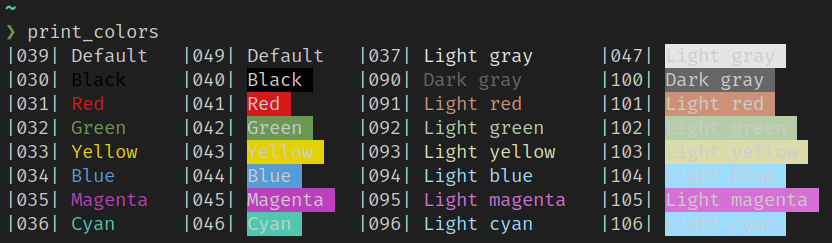          |
|                   **_dark_pride_**<br>[source](https://github.com/kovidgoyal/kitty-themes/blob/master/themes/dark_pride.conf)                     |          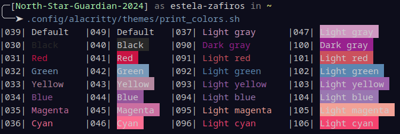          |
| **_dawnfox_**<br>[source](https://github.com/EdenEast/nightfox.nvim/blob/7557f26defd093c4e9bc17f28b08403f706f5a44/extra/dawnfox/alacritty.toml)   | 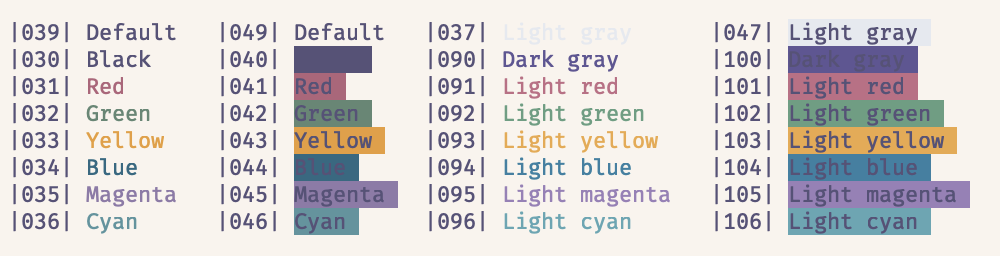 |
| **_dayfox_**<br>[source](https://github.com/EdenEast/nightfox.nvim/blob/7557f26defd093c4e9bc17f28b08403f706f5a44/extra/dayfox/alacritty.toml)   | 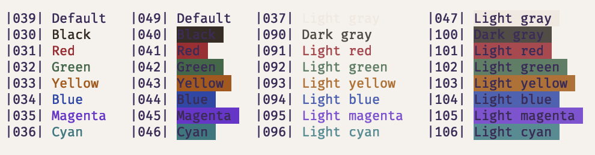 |
|                                                                  **_deep_space_**                                                                 |             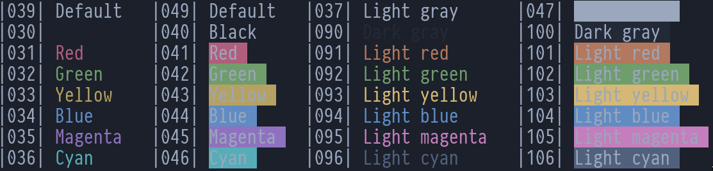           |
|                                     **_doom_one_**<br>[source](https://github.com/hlissner/emacs-doom-themes)                                     |                            |
|                                                **_dracula_**<br>[source](https://draculatheme.com)                                                |                              |
|                                                **_dracula_plus_**<br>[source](https://draculatheme.com)                                           |               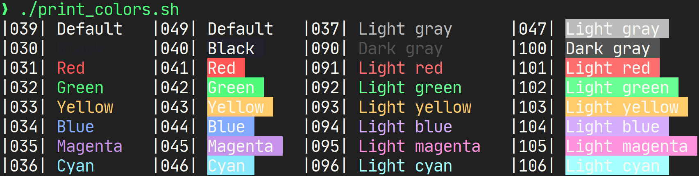     |
| **_duskfox_**<br>[source](https://github.com/EdenEast/nightfox.nvim/blob/7557f26defd093c4e9bc17f28b08403f706f5a44/extra/duskfox/alacritty.toml)   | 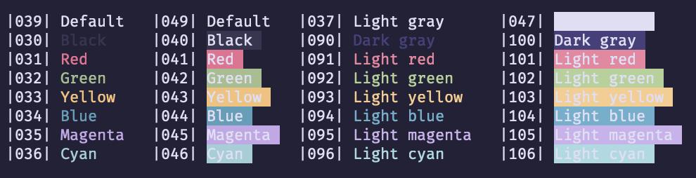 |
|                                                **_enfocado_dark_**<br>[source](https://github.com/wuelnerdotexe/vim-enfocado.git)                 |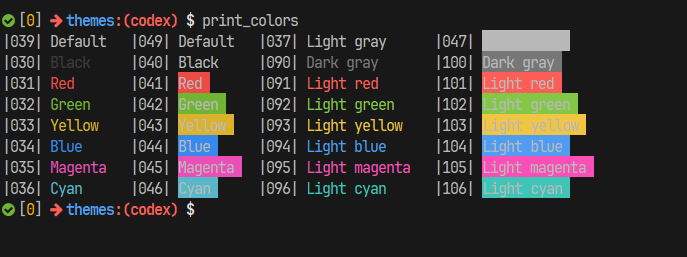    |
|                                                **_enfocado_light_**<br>[source](https://github.com/wuelnerdotexe/vim-enfocado.git)                |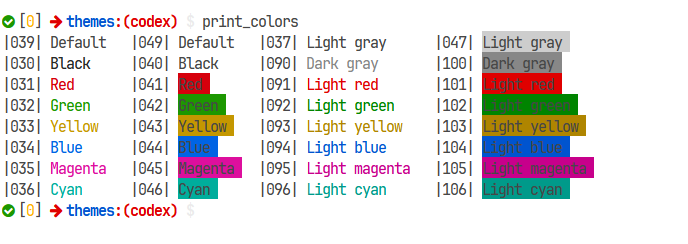  |
|                                     **_everforest_dark_**<br>[source](https://github.com/sainnhe/everforest)                                      |              |
|                                     **_everforest_light_**<br>[source](https://github.com/sainnhe/everforest)                                     |            |
|                                           **_falcon_**<br>[source](https://github.com/fenetikm/falcon)                                            |                                |
|                          **_flat_remix_**<br>[source](https://github.com/Mayccoll/Gogh/blob/master/themes/flat-remix.sh)                          |                        |
| **_flexoki_**<br>[source](https://github.com/kepano/flexoki/tree/main/alacritty)                                                                  | 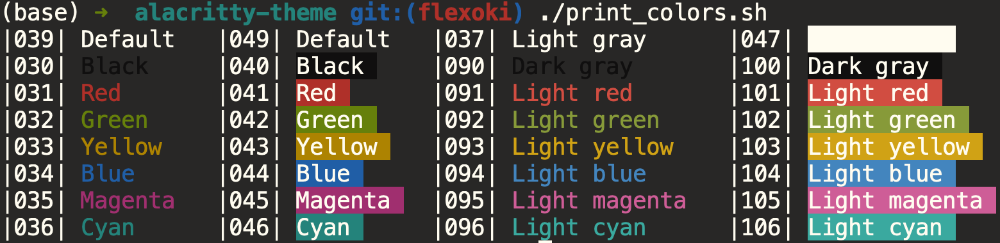                             |
| **_github_dark_**<br>[source](https://github.com/projekt0n/github-theme-contrib/blob/main/themes/alacritty/github_dark.yml)                          |                          |
| **_github_dark_colorblind_**<br>[source](https://github.com/projekt0n/github-theme-contrib/blob/main/themes/alacritty/github_dark_colorblind.yml)  |    |
| **_github_dark_dimmed_**<br>[source](https://github.com/projekt0n/github-theme-contrib/blob/main/themes/alacritty/github_dark_dimmed.yml)          |            |
| **_github_dark_high_contrast_**<br>[source](https://github.com/projekt0n/github-theme-contrib/blob/main/themes/alacritty/github_dark_high_contrast.yml)| 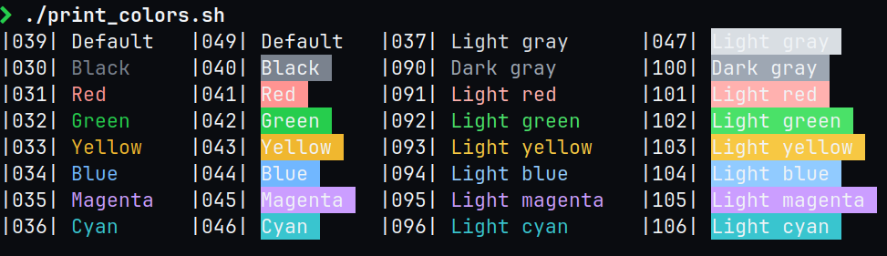|
| **_github_dark_tritanopia_**<br>[source](https://github.com/projekt0n/github-theme-contrib/blob/main/themes/alacritty/github_dark_tritanopia.yml)  | 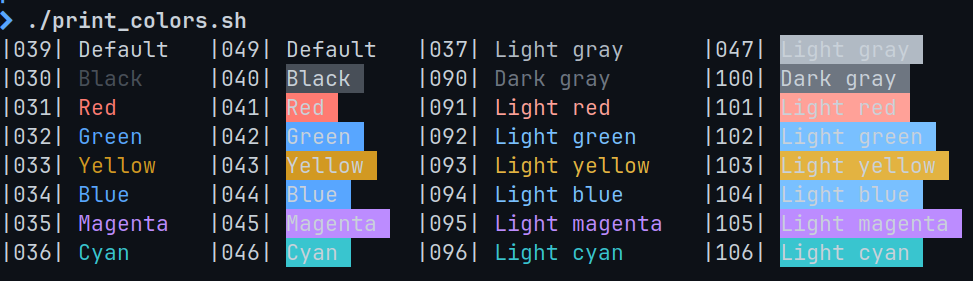   |
| **_github_light_**<br>[source](https://github.com/projekt0n/github-theme-contrib/blob/main/themes/alacritty/github_light.yml)                      |                        |
| **_github_light_colorblind_**<br>[source](https://github.com/projekt0n/github-theme-contrib/blob/main/themes/alacritty/github_light_colorblind.yml)|  |
| **_github_light_high_contrast_**<br>[source](https://github.com/projekt0n/github-theme-contrib/blob/main/themes/alacritty/github_light_high_contrast.yml)| 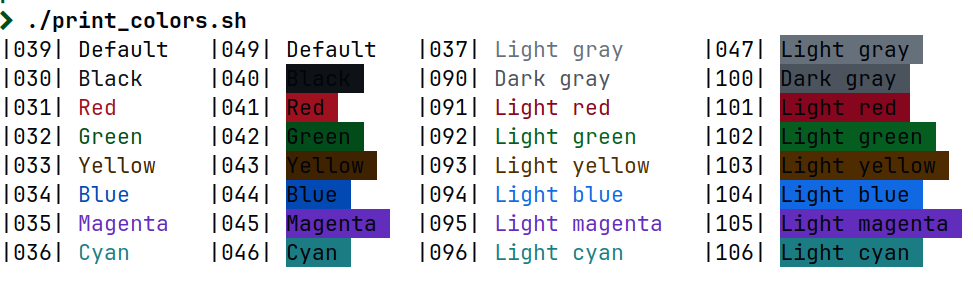|
| **_github_light_tritanopia_**<br>[source](https://github.com/projekt0n/github-theme-contrib/blob/main/themes/alacritty/github_light_tritanopia.yml)| 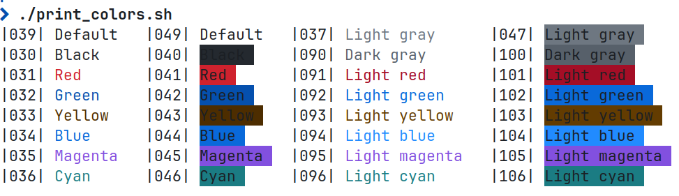 |
|                                                                   **_google_**                                                                    |                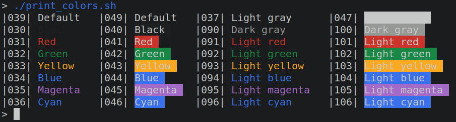                |
|                                                                   **_gotham_**                                                                    |                                |
|                                  **_gnome_terminal_**<br>[source](https://gitlab.gnome.org/GNOME/gnome-terminal)                                  |                |
|                                        **_gruber_darker_**<br>[source](https://github.com/rexim/gruber-darker-theme)                                         |          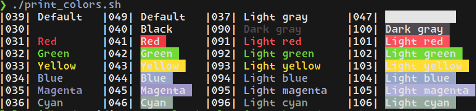          |
|                                        **_gruvbox_dark_**<br>[source](https://github.com/morhetz/gruvbox)                                         |                    |
|                                        **_gruvbox_light_**<br>[source](https://github.com/morhetz/gruvbox)                                        |                  |
|                                  **_gruvbox_material_hard_dark_**<br>[source](https://github.com/sainnhe/gruvbox-material)                        | 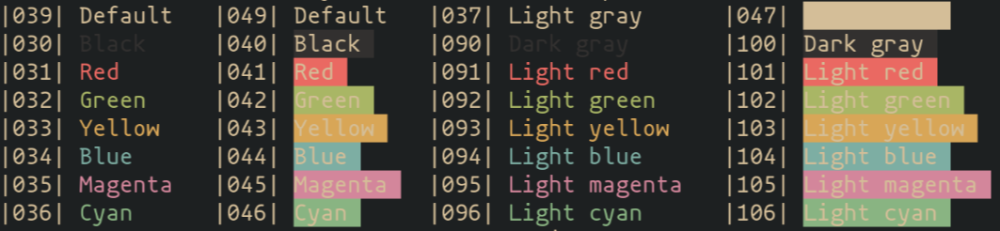   |
|                                  **_gruvbox_material_hard_light_**<br>[source](https://github.com/sainnhe/gruvbox-material)                       | 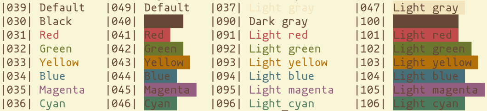 |
|                                  **_gruvbox_material_medium_dark_**<br>[source](https://github.com/sainnhe/gruvbox-material)                      |  |
|                                  **_gruvbox_material_medium_light_**<br>[source](https://github.com/sainnhe/gruvbox-material)                      |  |
|                                  **_hardhacker_**<br>[source](https://github.com/hardhackerlabs/theme-alacritty)                                  |                        |
|                                  **_hatsunemiku_**<br>[source](https://github.com/4513ECHO/vim-colors-hatsunemiku/)                               |            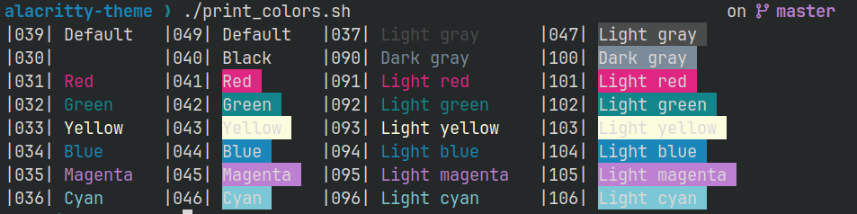          |
|                                                                **_high_contrast_**                                                                |                  |
|                                 **_horizon_dark_**<br>[source](https://github.com/jolaleye/horizon-theme-vscode)                                  |                    |
|                                                     **_hyper_**<br>[source](https://hyper.is)                                                     |                                  |
|                                 **_inferno_**<br>[source](https://github.com/hafiz-muhammad/inferno-alacritty-theme)                              |                 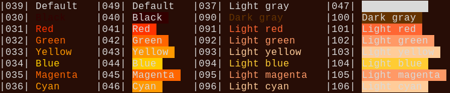             |
|                                 **_iris_**<br>[source](https://github.com/DioptricDesign/Iris)                                                    |                 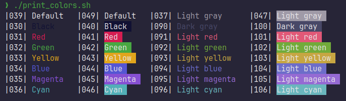                   |
|                                                                    **_iterm_**                                                                    |                                  |
|                                 **_kanagawa_dragon_**<br>[source](https://github.com/rebelot/kanagawa.nvim)                                       |          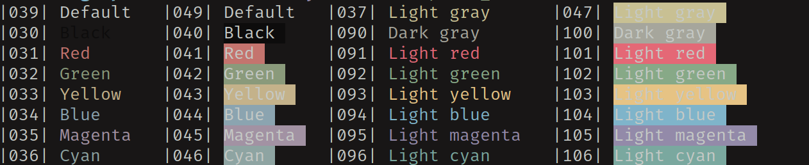    |
|                                  **_kanagawa_wave_**<br>[source](https://github.com/rebelot/kanagawa.nvim)                                        |          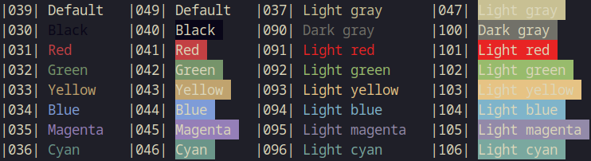        |
|                                  **_kimbie_dark_**<br>[source](https://github.com/idleberg/Kimbie.tmTheme)                                        |          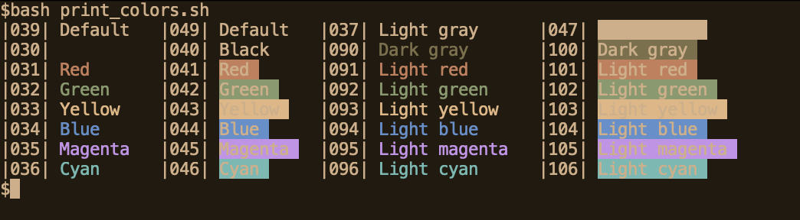            |
|                                  **_kimbie_light_**<br>[source](https://github.com/idleberg/Kimbie.tmTheme)                                        |          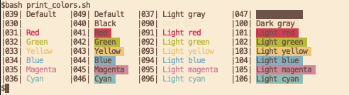          |
|                                                                **_konsole_linux_**                                                                |                          |
|                                                                **_low_contrast_**                                                                 |                           |
|                  **_Mariana_**<br>[source](https://github.com/mbadolato/iTerm2-Color-Schemes/blob/master/alacritty/Mariana.yml)                   |                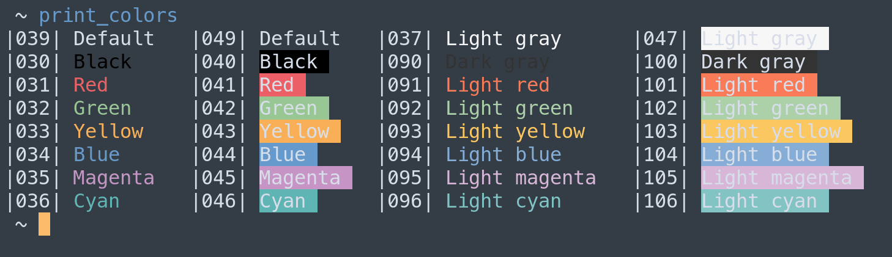                |
|                  **_marine_dark_**<br>[source](https://github.com/ProDeSquare/alacritty-colorschemes/blob/master/themes/marine_dark.yaml)         |                         |
|                                  **_material_theme_**<br>[source](https://github.com/equinusocio/material-theme)                                  |                |
|                                                             **_material_theme_mod_**                                                              |        |
|                  **_meliora_**<br>[source](https://github.com/ramojus/mellifluous.nvim)                                                           |                              |
|                  **_miasma_**<br>[source](https://github.com/xero/miasma.nvim/blob/main/extras/miasma.toml)                                       |               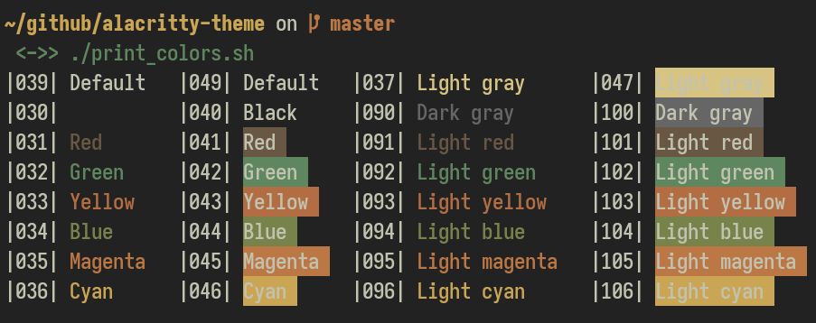                 |
|                  **_midnight_haze_**<br>[source](https://github.com/hafiz-muhammad/midnight-haze-alacritty-theme)                                 |                  |
|    **_monokai_**<br>[source](https://unpkg.com/browse/alacritty-themes@4.1.5/themes/Monokai.dark.yml)                                             |    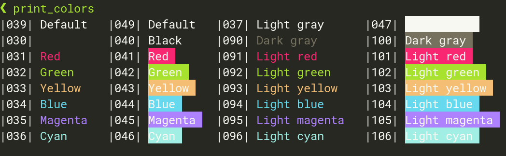                          |
|    **_monokai_charcoal_**<br>[source](https://github.com/dodeca12/Monokai-Charcoal-Theme-for-Alacritty/blob/main/monokai_charcoal_white.yaml)     |      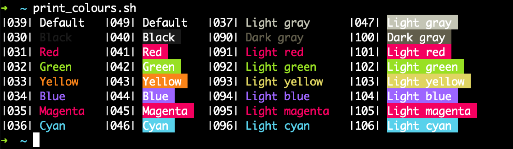      |
|                      **_monokai_pro_**<br>[source](https://gist.github.com/AlphaTechnolog/d1d5f6557f77f71519cb5713268da7dd)                       |                      |
|                                      **_moonfly_**<br>[source](https://github.com/bluz71/vim-moonfly-colors)                                      |               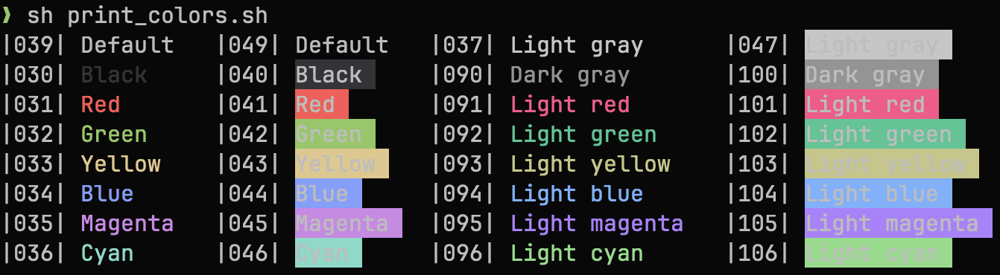               |
|                             **_moonlight_ii_vscode_**<br>[source](https://github.com/atomiks/moonlight-vscode-theme)                              |      |
|                                            **_msx_**<br>[source](https://paulwratt.github.io/programmers-palettes/HW-MSX/HW-MSX-palettes.html)    |              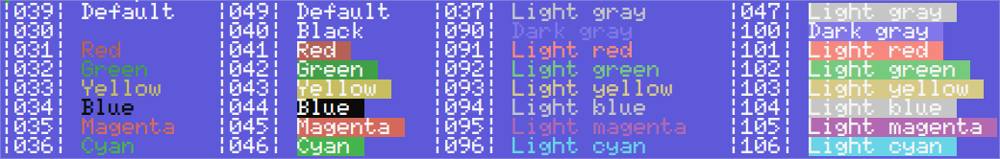              |
|                                       **_nightfly_**<br>[source](https://github.com/bluz71/vim-nightfly-colors)                                   |                            |
|                                       **_nightfox_**<br>[source](https://github.com/EdenEast/nightfox.nvim/blob/7557f26defd093c4e9bc17f28b08403f706f5a44/extra/nightfox/alacritty.toml)                                       |              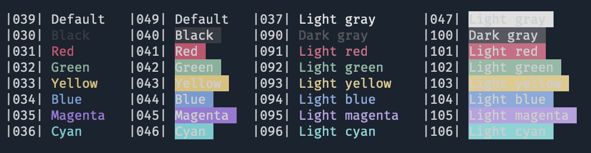              |
|                                       **_night_owl_**<br>[source](https://vscodethemes.com/e/sdras.night-owl/night-owl)                           |             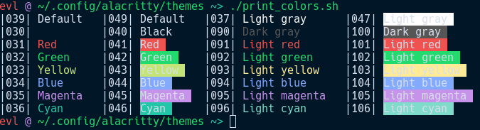             |
|                                                             **_night_owlish_light_**                                                              |        |
|                                       **_noctis_lux_**<br>[source](https://github.com/liviuschera/noctis)                                         |                            |
|                                          **_nord_**<br>[source](https://github.com/nordtheme/alacritty)                                          |                                    |
| **_nordfox_**<br>[source](https://github.com/EdenEast/nightfox.nvim/blob/7557f26defd093c4e9bc17f28b08403f706f5a44/extra/nordfox/alacritty.toml)   | 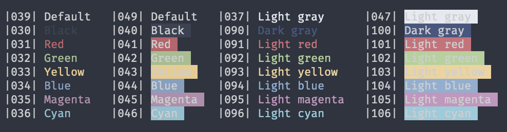 |
|                                          **_nordic_**<br>[source](https://github.com/AlexvZyl/nordic.nvim)                                          |                                    |
|                                          **_nord_light_**<br>[source](https://github.com/nordtheme/alacritty/issues/28#issuecomment-1422225211)                                          |                  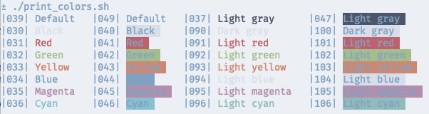                  |
|                             **_oceanic_next_**<br>[source](https://github.com/voronianski/oceanic-next-color-scheme)                              |                    |
|                                  **_omni_**<br>[source](https://github.com/getomni/alacritty/blob/main/omni.yml)                                  |                                    |
|                                                                  **_one_dark_**                                                                   |                            |
|                  **_one_light_**<br>[source](https://github.com/dexpota/kitty-themes/blob/master/themes/AtomOneLight.conf)                   |                     |
|                               **_oxocarbon_**<br>[source](https://github.com/nyoom-engineering/oxocarbon.nvim/tree/main)                          |              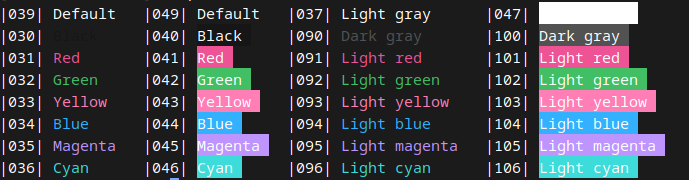            |
|                                  **_palenight_**<br>[source](https://github.com/JonathanSpeek/palenight-iterm2)                                   |                          |
|                                  **_panda_**<br>[source](https://github.com/siamak/panda-syntax-vscode)                                           |             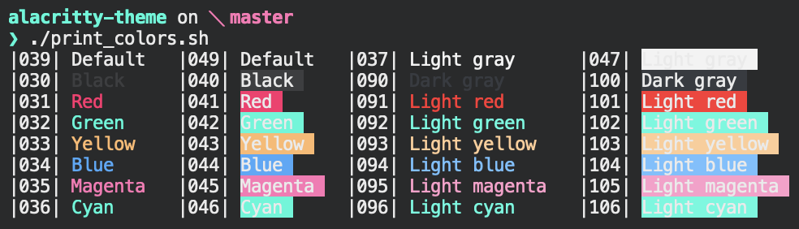                     |
|              **_papercolor_dark_**<br>[source](https://github.com/NLKNguyen/papercolor-theme/blob/master/colors/PaperColor.vim#L126)              |              |
|              **_papercolor_light_**<br>[source](https://github.com/NLKNguyen/papercolor-theme/blob/master/colors/PaperColor.vim#L36)              |            |
|                  **_papertheme_**<br>[source](https://github.com/s6muel/paper-theme/blob/main/themes/alacritty/paper-theme.yml)                   |                  |
|**_pastel_dark_**<br>[source](https://github.com/gnachman/iTerm2/blob/01c280152acebfe123f56e0215a3c178297a0edc/plists/ColorPresets.plist#L3715-L3924)|          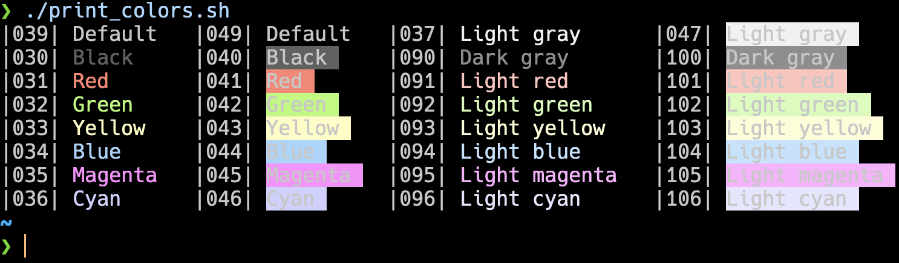           |
|                                   **_pencil_dark_**<br>[source](https://github.com/mattly/iterm-colors-pencil)                                    |                      |
|                                   **_pencil_light_**<br>[source](https://github.com/mattly/iterm-colors-pencil)                                   |                    |
|                                                                   **_rainbow_**                                                                   |               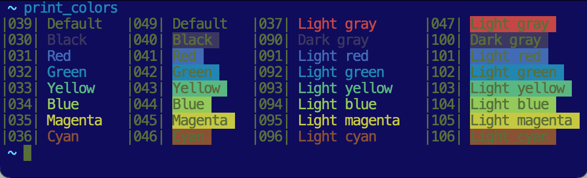               |
|                                  **_remedy_dark_**<br>[source](https://github.com/robertrossmann/vscode-remedy)                                   |                      |
|                                           **_rigel_**<br>[source](https://github.com/Rigellute/rigel)                                             |                 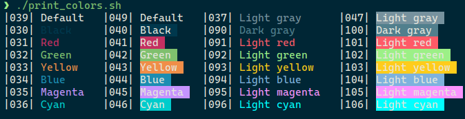                 |
|                                        **_rose_pine_**<br>[source](https://github.com/rose-pine/alacritty)                                        |                          |
|                                        **_rose_pine_dawn_**<br>[source](https://github.com/rose-pine/alacritty)                                        |                          |
|                                        **_rose_pine_moon_**<br>[source](https://github.com/rose-pine/alacritty)                                        |                          |
|         **seashells**<br>[source](https://raw.githubusercontent.com/mbadolato/iTerm2-Color-Schemes/master/schemes/SeaShells.itermcolors)          |                          |
|         **selenized_dark**<br>[source](https://github.com/jan-warchol/selenized/blob/master/terminals/alacritty/selenized-dark.yml)               |         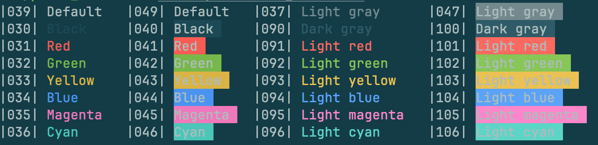       |
|         **selenized_light**<br>[source](https://github.com/jan-warchol/selenized/blob/master/terminals/alacritty/selenized-light.yml)             |         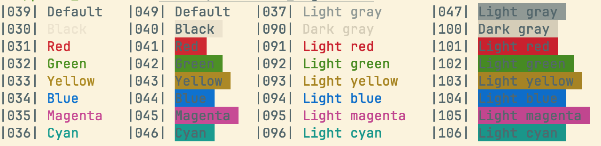     |
|         **seoul256-light**<br>[source](https://github.com/junegunn/seoul256.vim)                                                                  |         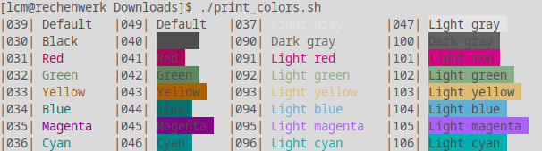        |
| **smoooooth**<br>[source](https://github.com/gnachman/iTerm2/blob/33945e63ad48ed80d6cc1adf7cbeb663217652d2/plists/ColorPresets.plist#L4345-L4685) |                          |
|                                      **_snazzy_**<br>[source](https://github.com/sindresorhus/hyper-snazzy)                                       |                                |
|                                      **_solarized_dark_**<br>[source](http://ethanschoonover.com/solarized)                                       |                |
|                                      **_solarized_light_**<br>[source](http://ethanschoonover.com/solarized)                                      |              |
|                               **_solarized_osaka_**<br>[source](https://github.com/craftzdog/solarized-osaka.nvim)                                |     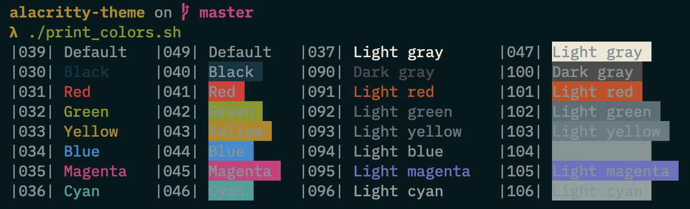         |
|                                           **_sonokai_**<br>[source](https://github.com/sainnhe/sonokai)                                           |               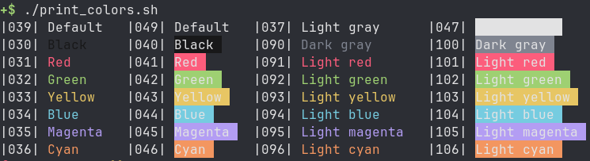               |
|                                   **_spacegray_**<br>[source](https://github.com/SublimeText/Spacegray)                                           |            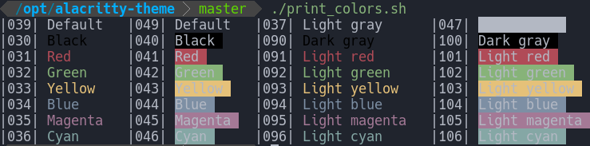
|                                   **_synthwave_84_**<br>[source](https://github.com/robb0wen/synthwave-vscode)                                    |        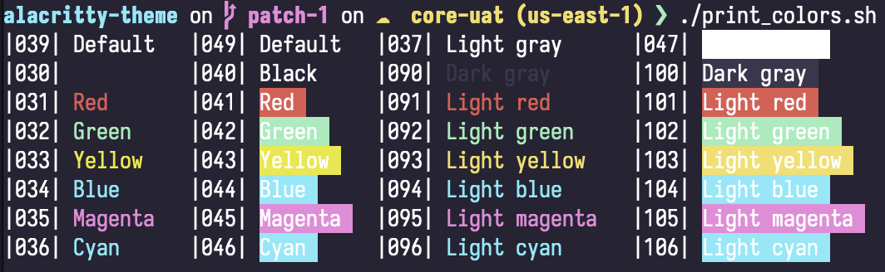            |
|                                    **_taerminal_**<br>[source](https://github.com/cozywigwam/iterm-taerminal)                                     |                          |
|   **_tango_dark_**<br>[source](https://github.com/GNOME/gnome-terminal/blob/18939a24d21d6b7c6edd57a00a3a8a48f3aecec5/src/profile-editor.c#L213)   |                        |
|                                      **_tender_**<br>[source](https://github.com/huyvohcmc/tender-alacritty)                                      |                                |
| **_terafox_**<br>[source](https://github.com/EdenEast/nightfox.nvim/blob/7557f26defd093c4e9bc17f28b08403f706f5a44/extra/terafox/alacritty.toml)   | 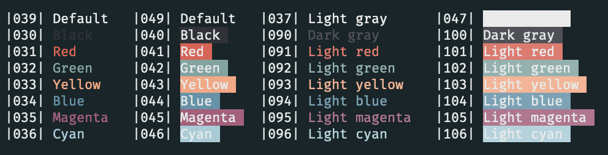 |
|                                                                **_terminal_app_**                                                                 |                    |
|                                                                 **_thelovelace_**                                                                 |                     |
|                             **_tokyo_night_**<br>[source](https://github.com/zatchheems/tokyo-night-alacritty-theme)                              |                      |
|                          **_tokyo_night_storm_**<br>[source](https://github.com/zatchheems/tokyo-night-alacritty-theme)                           |          |
|                          **_tokyo_night_enhanced_**<br>[source](https://github.com/Venage5603/Tokyo-Night-Dark-Enhanced)                          | 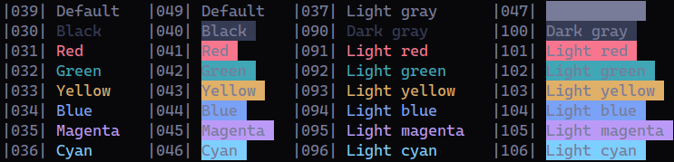   |
|                                 **_tomorrow_night_**<br>[source](https://github.com/ChrisKempson/Tomorrow-Theme)                                  |        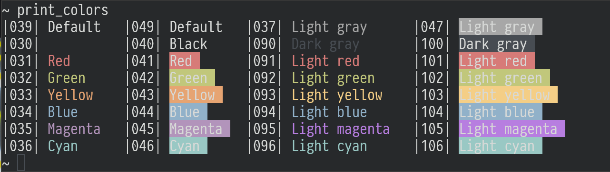        |
|                              **_tomorrow_night_bright_**<br>[source](https://github.com/ChrisKempson/Tomorrow-Theme)                              | 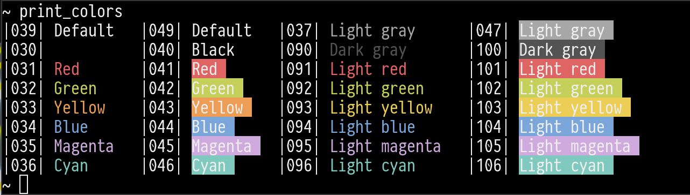 |
|                                     **_ubuntu_**<br>[source](https://design.ubuntu.com/brand/colour-palette/)                                     |                                |
|                                     **_vesper_**<br>[source](https://github.com/raunofreiberg/vesper)                                             |                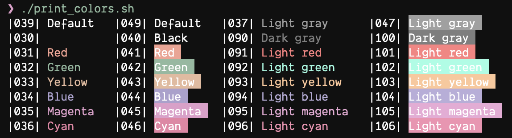                |
|     **_vscode_**<br>[source](https://github.com/microsoft/vscode/blob/main/src/vs/workbench/contrib/terminal/common/terminalColorRegistry.ts)     |                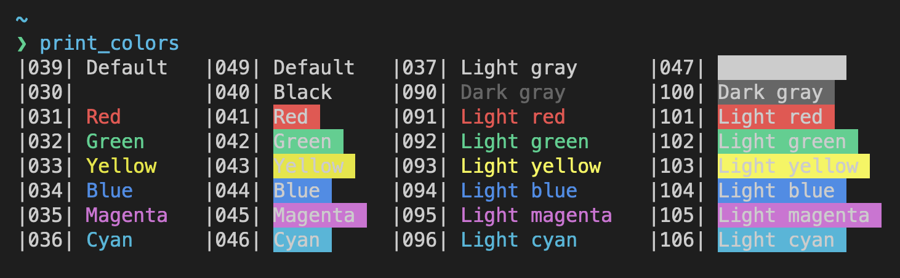                |
|                                        **_wombat_**<br>[source](https://github.com/djoyner/iTerm2-wombat)                                         |                                |
|                                                                    **_xterm_**                                                                    |                                  |
|                                          **_zenburn_**<br>[source](https://github.com/jnurmine/Zenburn)                                           |                              |

## Contributing

Bug reports and pull requests are welcome on GitHub at the [alacritty-theme]
repository.

[alacritty-theme]: https://github.com/alacritty/alacritty-theme

To add a new theme, please create a Pull Request. Note that submissions by theme
authors are not accepted, to ensure there's at least some community interest.
The following changes must be made for a new theme:

 - Add your theme to the `themes` directory with the `{theme}.toml` file format
 - Create a screenshot of your theme using the [`print_colors.sh`](./print_colors.sh) script
 - Add the screenshot to the `images` directory with the `{theme}.png` file format
 - Add your theme to the `README.md`, following alphabetical ordering

## Maintainers

 * **indrajit** - *Author* - [eendroroy](https://github.com/eendroroy)
 * **Christian Dürr** - *Maintainer* - [chrisduerr](https://github.com/chrisduerr)

## License

The project is available as open source under the terms of the [Apache License, Version 2.0](LICENSE)
