# Alacritty Theme

Collection of colorschemes for easy configuration of the [Alacritty terminal
emulator].

[Alacritty terminal emulator]: https://github.com/alacritty/alacritty

## Installation

### Imports

Clone the repository, or download the theme of your choice:

```sh
# We use Alacritty's default Linux config directory as our storage location here.
mkdir -p ~/.config/alacritty/themes
git clone https://github.com/alacritty/alacritty-theme ~/.config/alacritty/themes
```

Add an import to your `alacritty.yml` (Replace `{theme}` with your desired
colorscheme):

```yaml
import:
 - ~/.config/alacritty/themes/{variant}/{theme}.yaml
```

### Manual

To manually include a colorscheme in an existing `alacritty.yml`, you just need
to copy the entire content of the theme into the root level of your
configuration file.

## Color Schemes

|                                                                       NAME                                                                        |                           COLORS                           |
|:-------------------------------------------------------------------------------------------------------------------------------------------------:|:----------------------------------------------------------:|
|                                   **_afterglow_**<br>[source](https://github.com/YabataDesign/afterglow-theme)                                    |        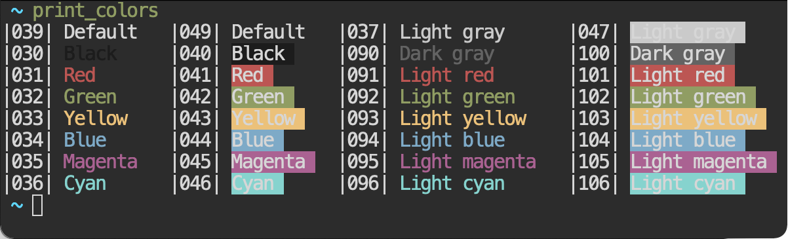        |
|                                   **_alabaster_**<br>[source](https://github.com/tonsky/vscode-theme-alabaster)                                   |                          |
|                                   **_alabaster_dark_**<br>[source](https://github.com/gargakshit/vscode-theme-alabaster-dark)                     |        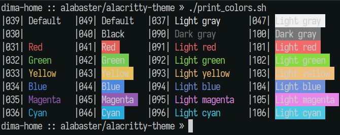        |
|                                      **_argonaut_**<br>[source](https://github.com/pwaleczek/Argonaut-theme)                                      |        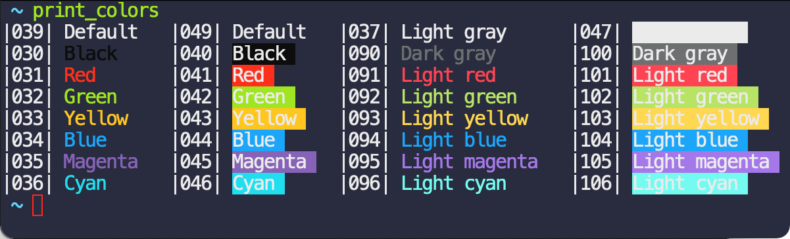         |
|                  **_atom_one_light_**<br>[source](https://github.com/dexpota/kitty-themes/blob/master/themes/AtomOneLight.conf)                   |        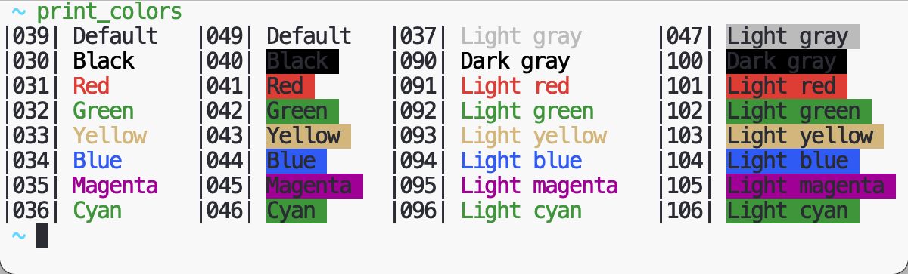        |
|                                        **_ayu_dark_**<br>[source](https://github.com/ayu-theme/ayu-colors)                                        |              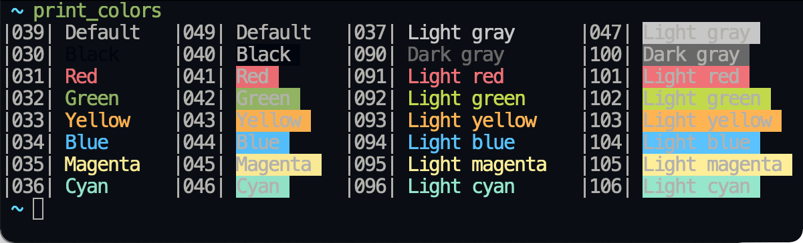              |
|                                       **_ayu_light_**<br>[source](https://github.com/ayu-theme/ayu-colors)                                        |             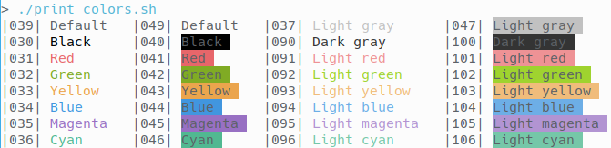             |
|                                   **_baitong_**<br>[source](https://github.com/cypj/baitong-theme)                                                |                              |
|                                   **_base16_default_dark_**<br>[source](https://github.com/chriskempson/base16)                                   |   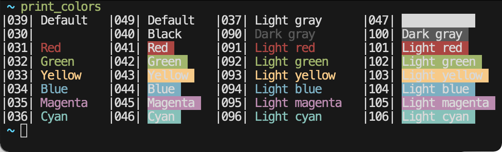   |
|                                         **_blood_moon_**<br>[source](https://github.com/dguo/blood-moon)                                          |            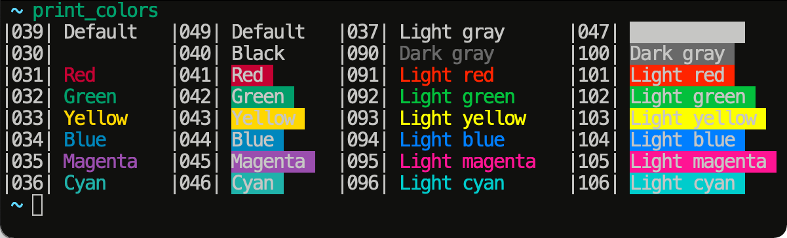            |
|                                                                   **_bluish_**                                                                    |                                |
|                                              **_breeze_**<br>[source](https://github.com/KDE/breeze)                                              |                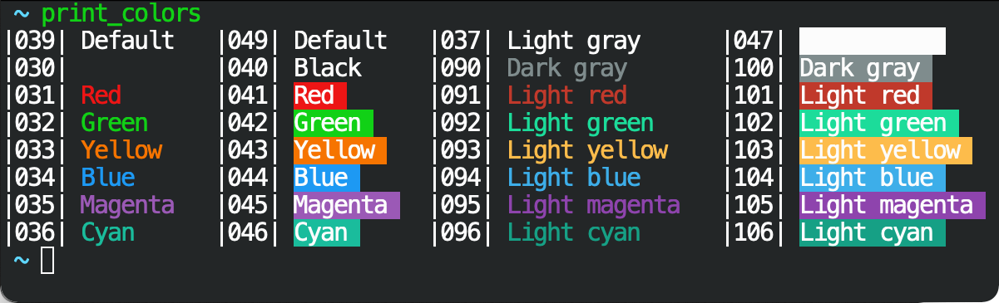                |
|              **_campbell_**<br>[source](https://blogs.msdn.microsoft.com/commandline/2017/08/02/updating-the-windows-console-colors)              |              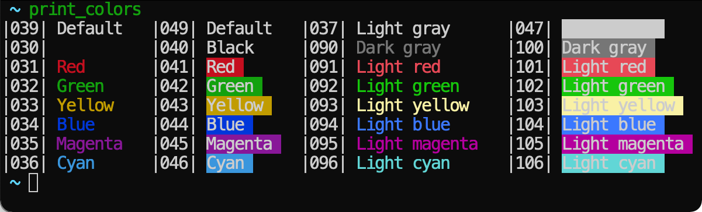              |
|              **_carbonfox_**<br>[source](https://github.com/edeneast/nightfox.nvim/raw/main/extra/carbonfox/nightfox_alacritty.yml)               |             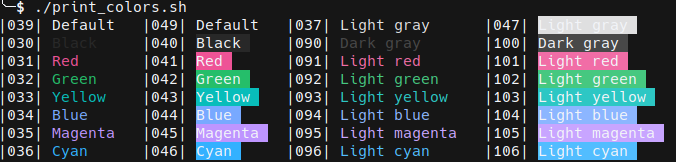             |
|              **_catppuccin_**<br>[source](https://github.com/catppuccin/catppuccin)                                                               |              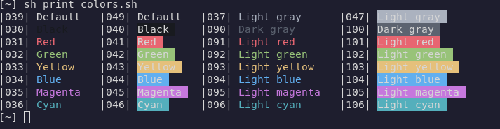          |
|                               **_challenger_deep_**<br>[source](https://github.com/challenger-deep-theme/alacritty)                               |       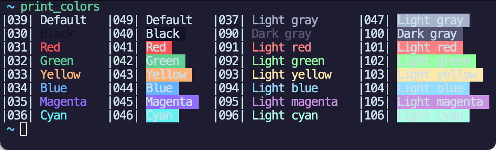       |
|                                              **_city_lights_**<br>[source](https://citylights.xyz/)                                               |           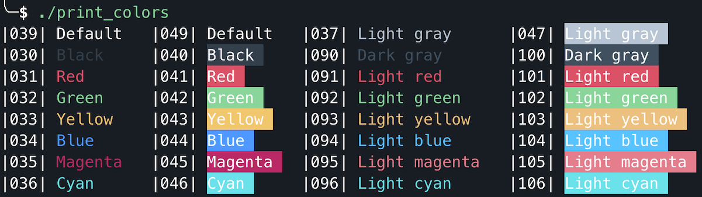            |
|                                 **_Cobalt2_**<br>[source](https://github.com/wesbos/cobalt2/tree/master/Cobalt2)                                  |               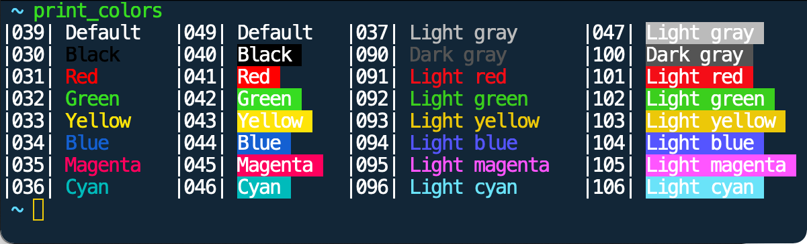               |
|                                 **_cyber_punk_neon_**<br>[source](https://github.com/Roboron3042/Cyberpunk-Neon)                                  |       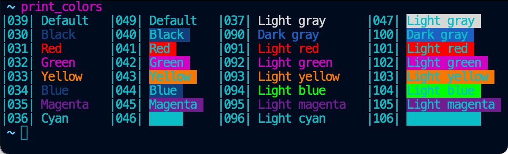       |
|                                                **_darcula_**<br>[source](https://draculatheme.com)                                                |               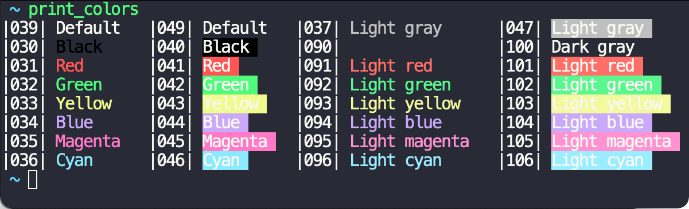               |
|         **_dark_pastels_**<br>[source](https://invent.kde.org/utilities/konsole/-/blob/master/data/color-schemes/DarkPastels.colorscheme)         |          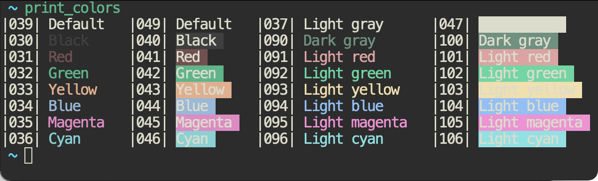          |
|                                                                  **_deep_space_**                                                                 |                        |                                         
|                                     **_doom_one_**<br>[source](https://github.com/hlissner/emacs-doom-themes)                                     |              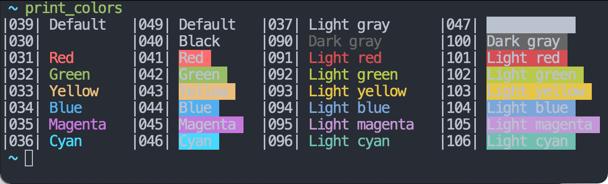              |
|                                                **_dracula_**<br>[source](https://draculatheme.com)                                                |               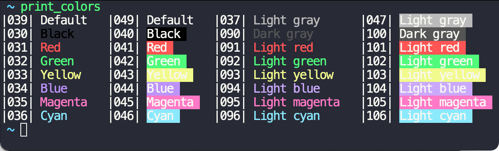               |
|                                     **_everforest_dark_**<br>[source](https://github.com/sainnhe/everforest)                                      |       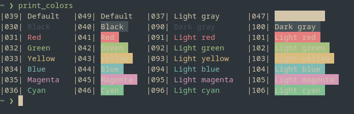       |
|                                     **_everforest_light_**<br>[source](https://github.com/sainnhe/everforest)                                     |      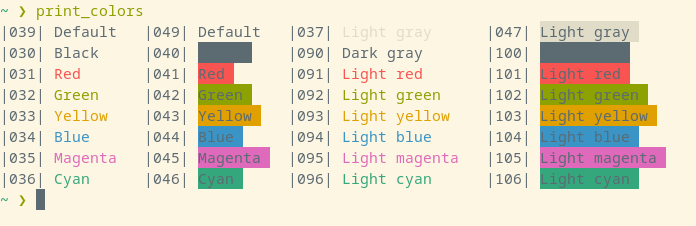      |
|                                           **_falcon_**<br>[source](https://github.com/fenetikm/falcon)                                            |                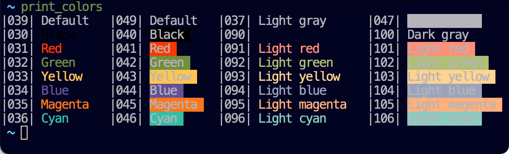                |
|                          **_flat_remix_**<br>[source](https://github.com/Mayccoll/Gogh/blob/master/themes/flat-remix.sh)                          |            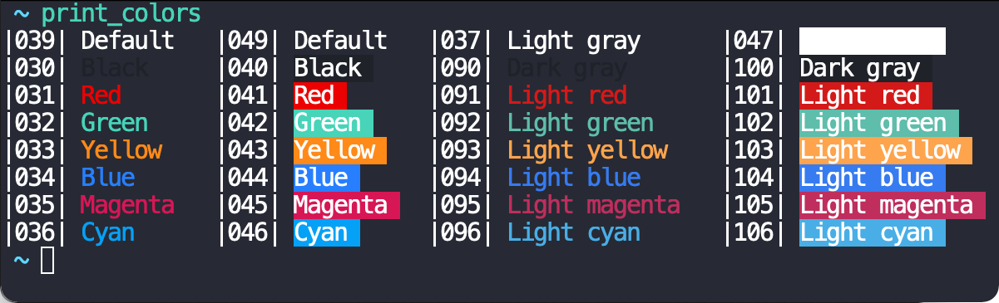            |
| **_github_dark_**<br>[source](https://github.com/projekt0n/github-theme-contrib/blob/main/alacritty/github_dark.yml)                              | 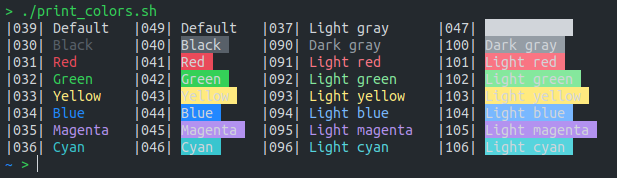                         |
| **_github_dark_colorblind_**<br>[source](https://github.com/projekt0n/github-theme-contrib/blob/main/alacritty/github_dark_colorblind.yml)        | 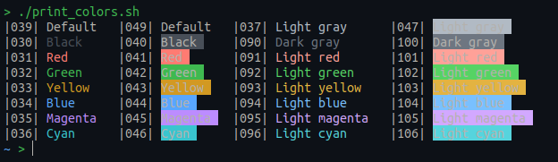   |
| **_github_dark_default_**<br>[source](https://github.com/projekt0n/github-theme-contrib/blob/main/alacritty/github_dark_default.yml)              | 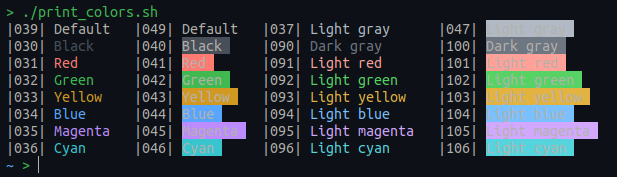         |
| **_github_dimmed_**<br>[source](https://github.com/projekt0n/github-theme-contrib/blob/main/alacritty/github_dimmed.yml)                          | 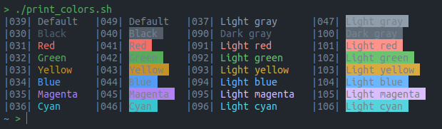                     |
| **_github_light_**<br>[source](https://github.com/projekt0n/github-theme-contrib/blob/main/alacritty/github_light.yml)                            | 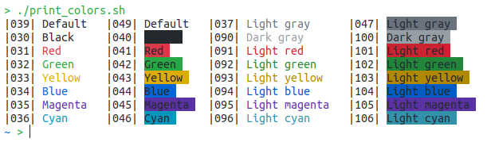                       |
| **_github_light_colorblind_**<br>[source](https://github.com/projekt0n/github-theme-contrib/blob/main/alacritty/github_light_colorblind.yml)      | 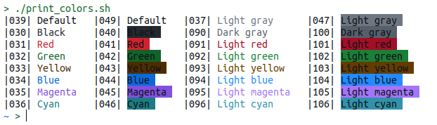 |
| **_github_light_default_**<br>[source](https://github.com/projekt0n/github-theme-contrib/blob/main/alacritty/github_light_default.yml)            | 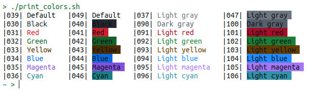       |
|                                                                   **_gotham_**                                                                    |                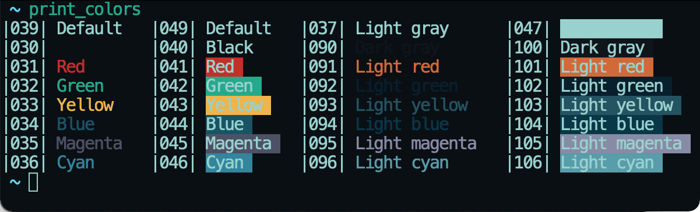                |
|                                  **_gnome_terminal_**<br>[source](https://gitlab.gnome.org/GNOME/gnome-terminal)                                  |        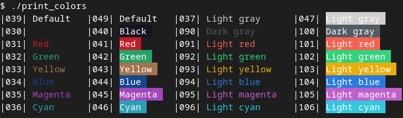        |
|                                        **_gruvbox_dark_**<br>[source](https://github.com/morhetz/gruvbox)                                         |          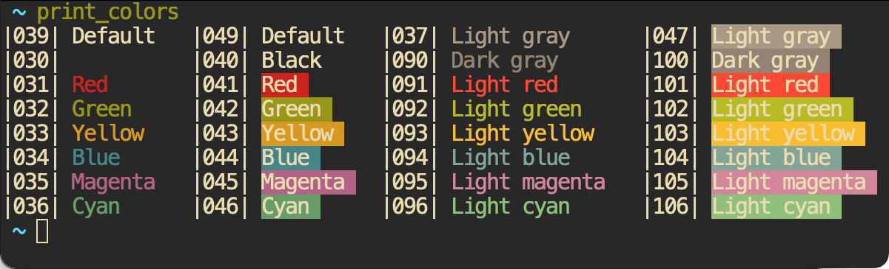          |
|                                        **_gruvbox_light_**<br>[source](https://github.com/morhetz/gruvbox)                                        |         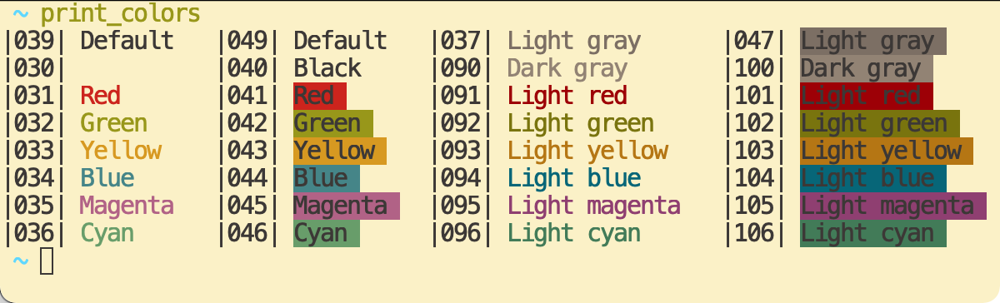         |
|                                  **_gruvbox_material_medium_dark_**<br>[source](https://github.com/sainnhe/gruvbox-material)                      | 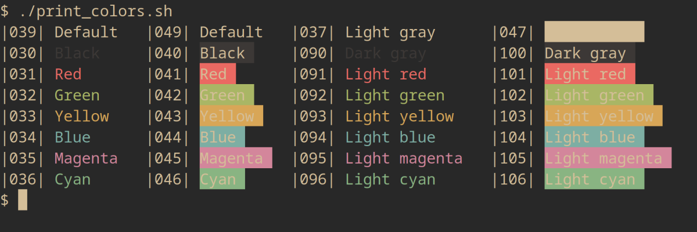 |
|                                  **_gruvbox_material_medium_light_**<br>[source](https://github.com/sainnhe/gruvbox-material)                      | 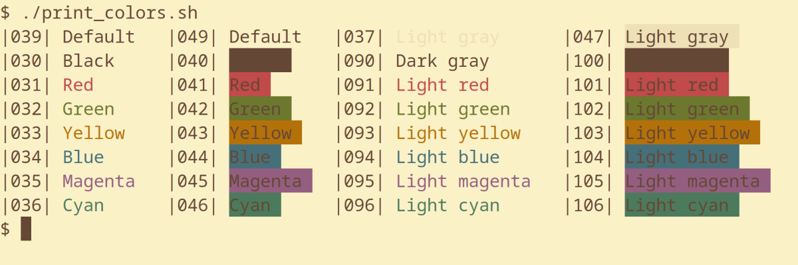 |
|                                  **_hardhacker_**<br>[source](https:/light//github.com/hardhackerlabs/theme-alacritty)                                  |      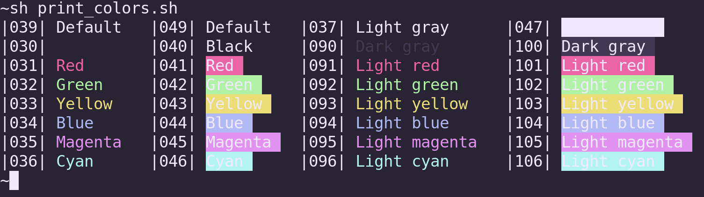                  |
|                                                                **_high_contrast_**                                                                |         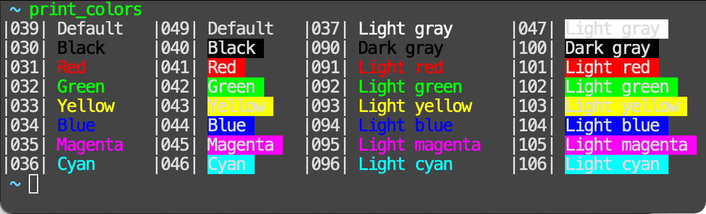         |
|                                 **_horizon-dark_**<br>[source](https://github.com/jolaleye/horizon-theme-vscode)                                  |          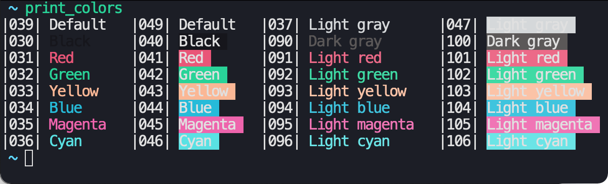          |
|                                                     **_hyper_**<br>[source](https://hyper.is)                                                     |                 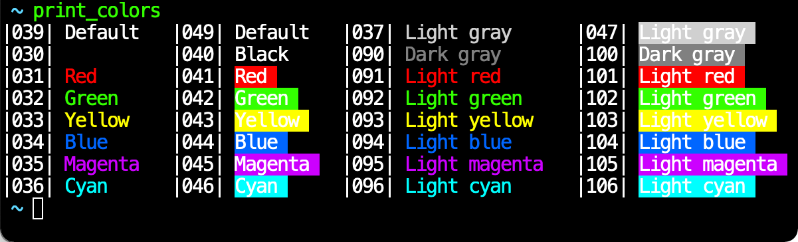                 |
|                                 **_inferno_**<br>[source](https://github.com/hafiz-muhammad/inferno-alacritty-theme)                              |                              |
|                                                                    **_iterm_**                                                                    |                 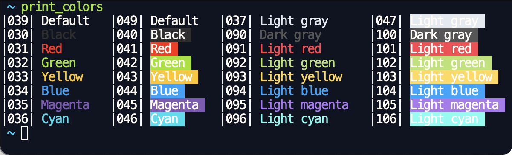                 |
|                                 **_kanagawa_dragon_**<br>[source](https://github.com/rebelot/kanagawa.nvim)                                       |          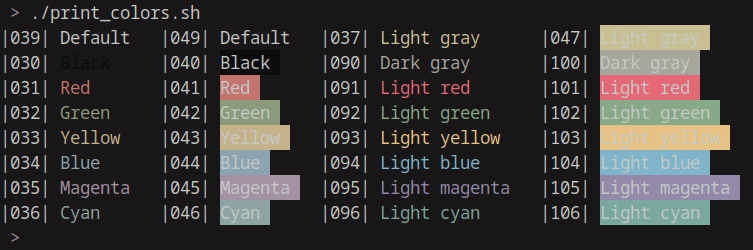    |
|                                  **_kanagawa_wave_**<br>[source](https://github.com/rebelot/kanagawa.nvim)                                        |          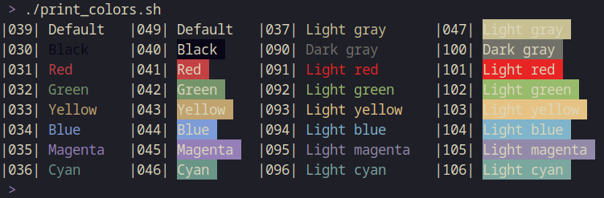        |
|                                                                **_konsole_linux_**                                                                |             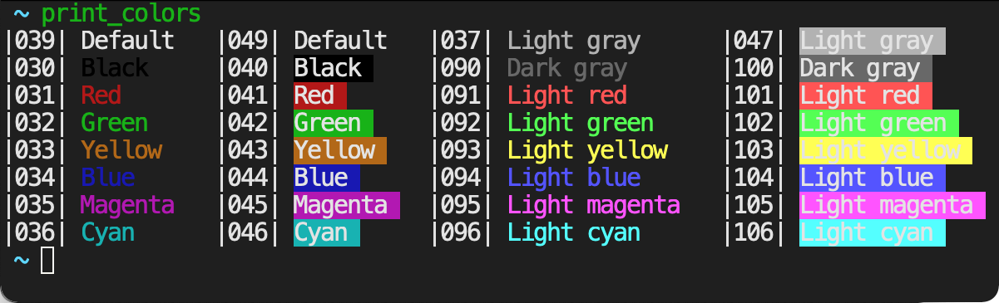             |
|                                                                **_low_contrast_**                                                                 |             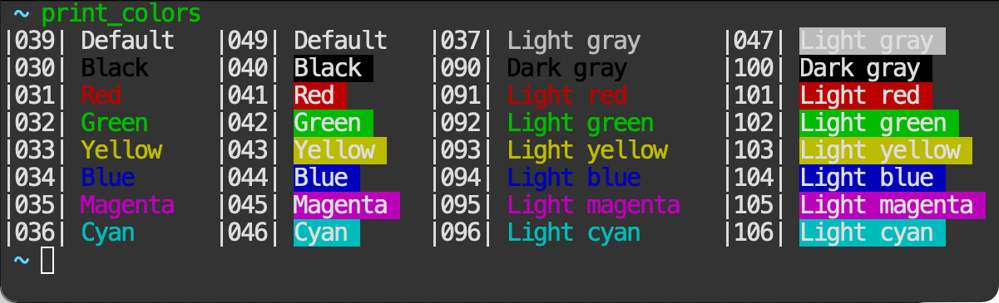              |
|                  **_Mariana_**<br>[source](https://github.com/mbadolato/iTerm2-Color-Schemes/blob/master/alacritty/Mariana.yml)                   |                                |
|                  **_marine_dark_**<br>[source](https://github.com/ProDeSquare/alacritty-colorschemes/blob/master/themes/marine_dark.yaml)         |                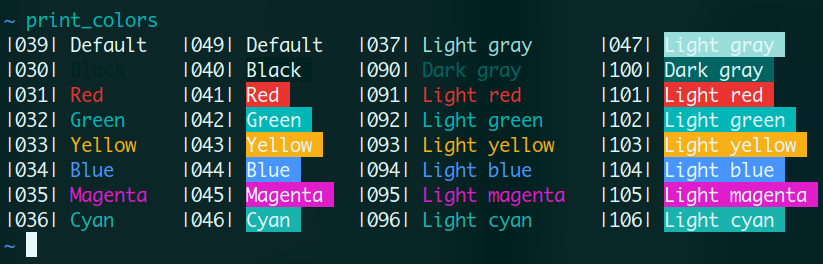         |
|                                  **_material_theme_**<br>[source](https://github.com/equinusocio/material-theme)                                  |        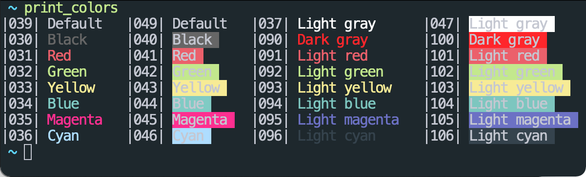        |
|                                                             **_material_theme_mod_**                                                              |    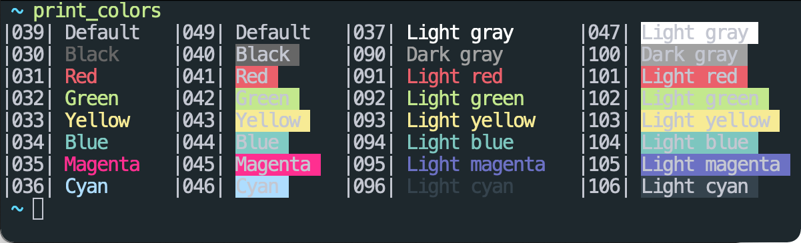    |
|                  **_meliora_**<br>[source](https://github.com/ramojus/mellifluous.nvim)                                                           |                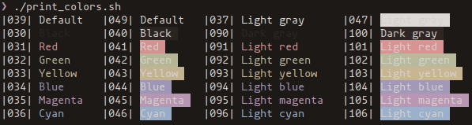              |
|                  **_midnight-haze_**<br>[source](https://github.com/hafiz-muhammad/midnight-haze-alacritty-theme)                                 |    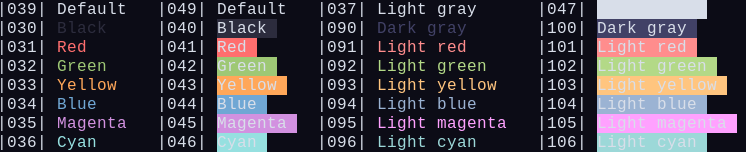              |
|    **_monokai_charcoal_**<br>[source](https://github.com/dodeca12/Monokai-Charcoal-Theme-for-Alacritty/blob/main/monokai_charcoal_white.yaml)     |            |
|                      **_monokai_pro_**<br>[source](https://gist.github.com/AlphaTechnolog/d1d5f6557f77f71519cb5713268da7dd)                       |           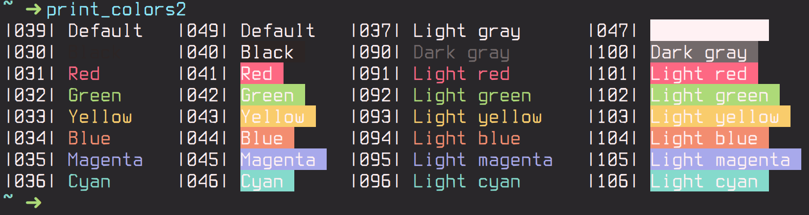           |
|                             **_moonlight_ii_vscode_**<br>[source](https://github.com/atomiks/moonlight-vscode-theme)                              |   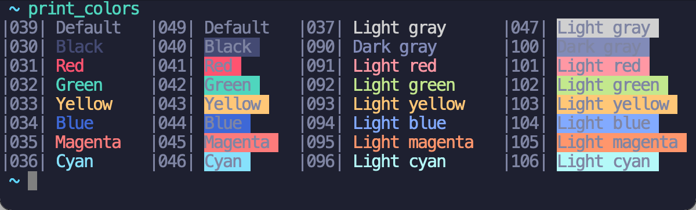   |
|                                            **_msx_**<br>[source](https://paulwratt.github.io/programmers-palettes/HW-MSX/HW-MSX-palettes.html)    |                            |
|                                       **_nightfox_**<br>[source](https://github.com/EdenEast/nightfox.nvim)                                       |              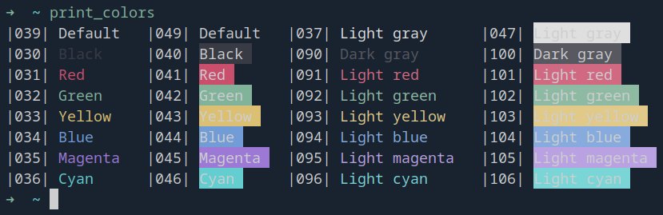              |
|                                                             **_night_owlish_light_**                                                              |    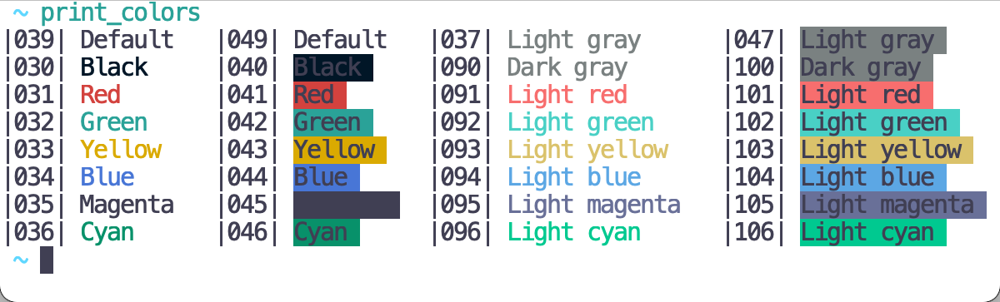    |
|                                       **_noctis-lux_**<br>[source](https://github.com/liviuschera/noctis)                                         |              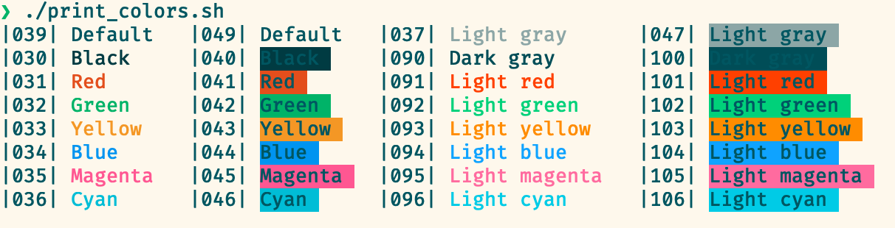              |
|                                          **_nord_**<br>[source](https://github.com/arcticicestudio/nord)                                          |                  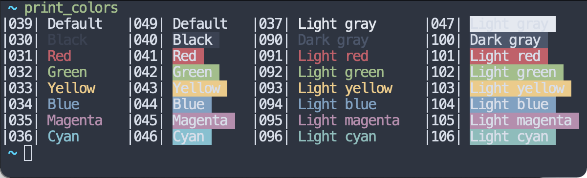                  |
|                                          **_nordic_**<br>[source](https://github.com/AlexvZyl/nordic.nvim)                                          |                  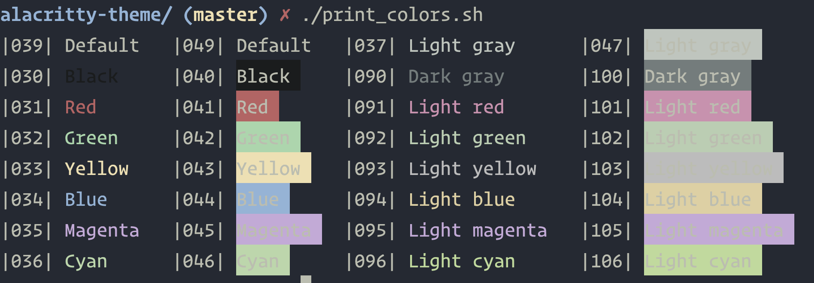                  |
|                                          **_nord_light_**<br>[source](https://github.com/nordtheme/alacritty/issues/28#issuecomment-1422225211)                                          |                                    |
|                             **_oceanic_next_**<br>[source](https://github.com/voronianski/oceanic-next-color-scheme)                              |          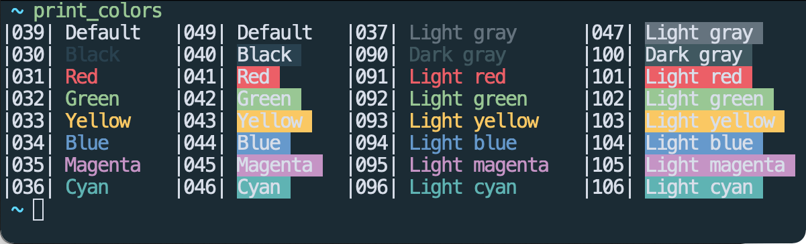          |
|                                  **_omni_**<br>[source](https://github.com/getomni/alacritty/blob/main/omni.yml)                                  |                  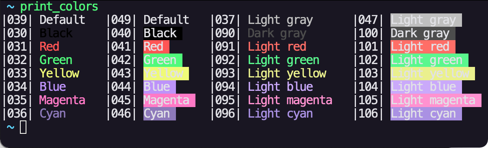                  |
|                                                                  **_one_dark_**                                                                   |              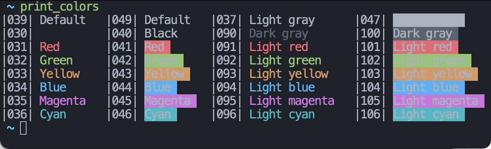              |
|                                  **_palenight_**<br>[source](https://github.com/JonathanSpeek/palenight-iterm2)                                   |             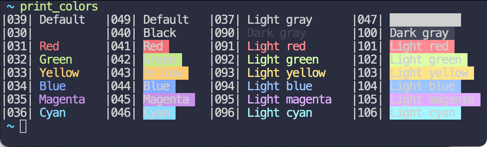             |
|              **_papercolor_dark_**<br>[source](https://github.com/NLKNguyen/papercolor-theme/blob/master/colors/PaperColor.vim#L126)              |       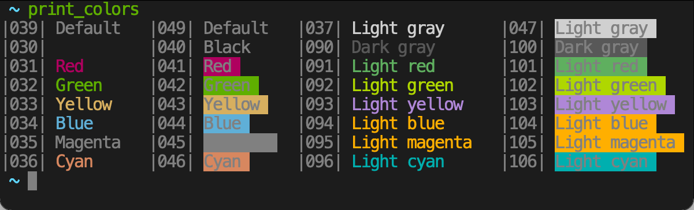       |
|              **_papercolor_light_**<br>[source](https://github.com/NLKNguyen/papercolor-theme/blob/master/colors/PaperColor.vim#L36)              |      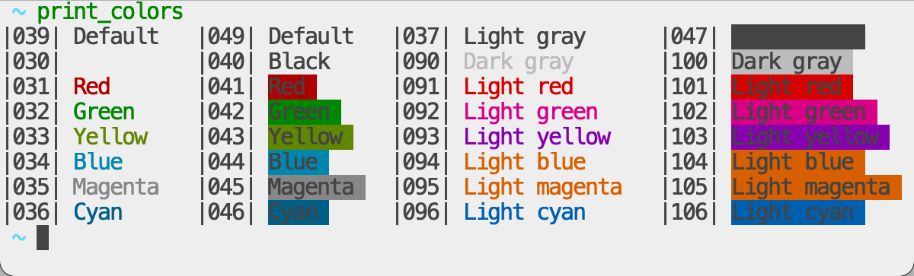      |
|                  **_papertheme_**<br>[source](https://github.com/s6muel/paper-theme/blob/main/themes/alacritty/paper-theme.yml)                   |         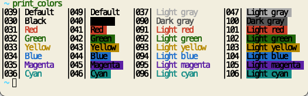         |
|                                   **_pencil_dark_**<br>[source](https://github.com/mattly/iterm-colors-pencil)                                    |           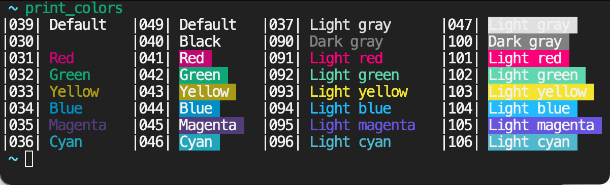           |
|                                   **_pencil_light_**<br>[source](https://github.com/mattly/iterm-colors-pencil)                                   |          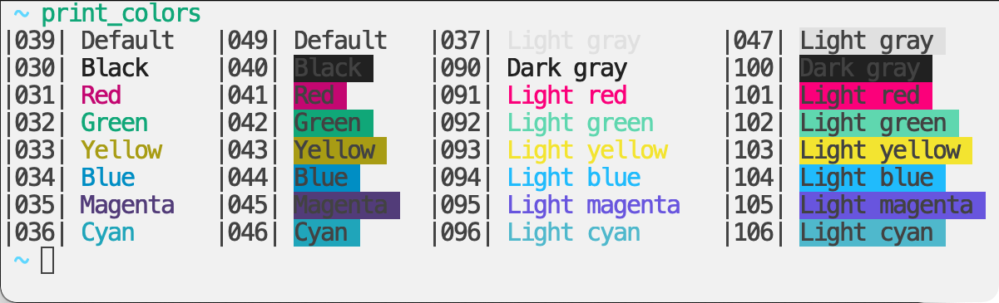          |
|                                                                   **_rainbow_**                                                                   |               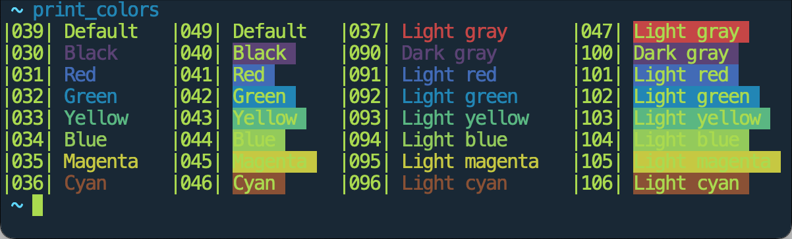               |
|                                  **_remedy_dark_**<br>[source](https://github.com/robertrossmann/vscode-remedy)                                   |           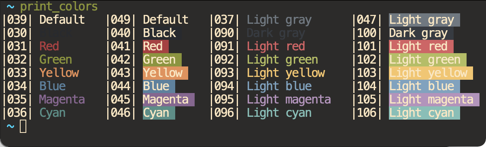           |
|                                        **_rose-pine_**<br>[source](https://github.com/rose-pine/alacritty)                                        |             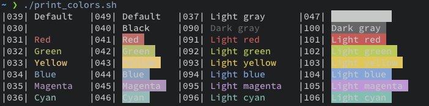             |
|                                        **_rose-pine-dawn_**<br>[source](https://github.com/rose-pine/alacritty)                                        |             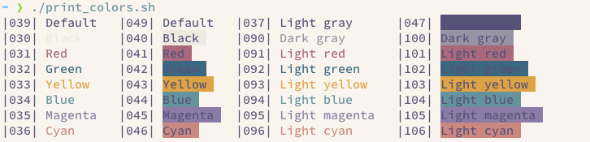             |
|                                        **_rose-pine-moon_**<br>[source](https://github.com/rose-pine/alacritty)                                        |             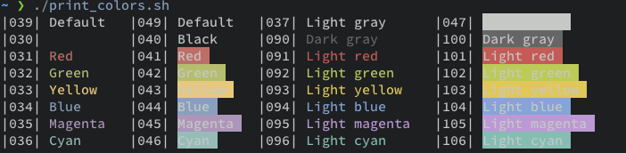             |
|                                      **_snazzy_**<br>[source](https://github.com/sindresorhus/hyper-snazzy)                                       |                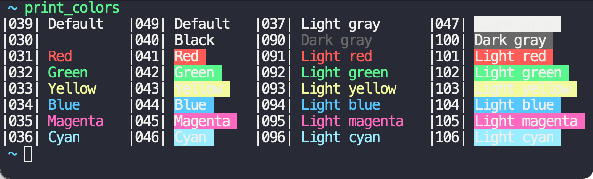                |
|         **seashells**<br>[source](https://raw.githubusercontent.com/mbadolato/iTerm2-Color-Schemes/master/schemes/SeaShells.itermcolors)          |             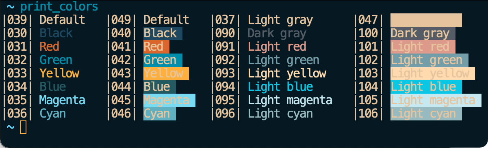             |
| **smoooooth**<br>[source](https://github.com/gnachman/iTerm2/blob/33945e63ad48ed80d6cc1adf7cbeb663217652d2/plists/ColorPresets.plist#L4345-L4685) |             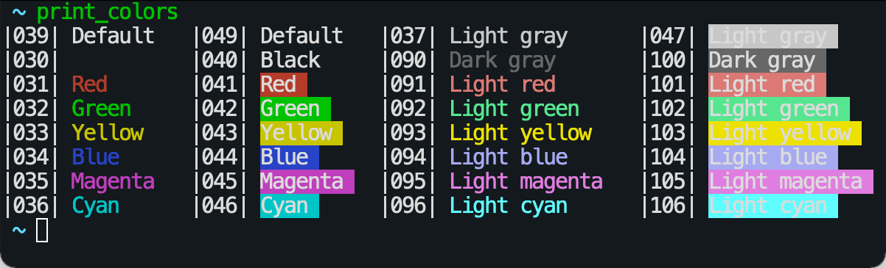             |
|                                      **_solarized_dark_**<br>[source](http://ethanschoonover.com/solarized)                                       |        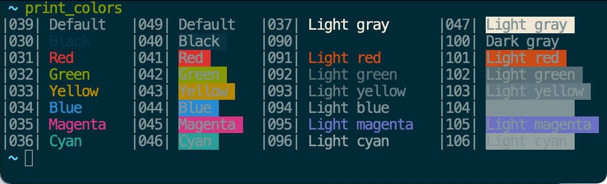        |
|                                      **_solarized_light_**<br>[source](http://ethanschoonover.com/solarized)                                      |       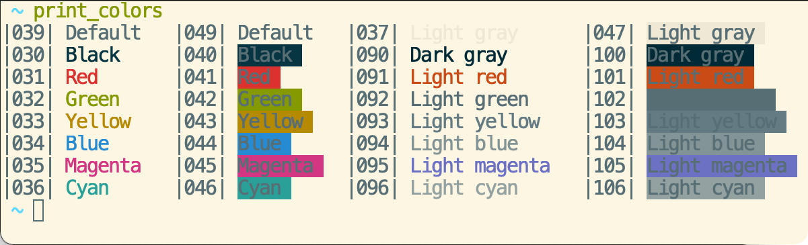       |
|                                    **_taerminal_**<br>[source](https://github.com/cozywigwam/iterm-taerminal)                                     |             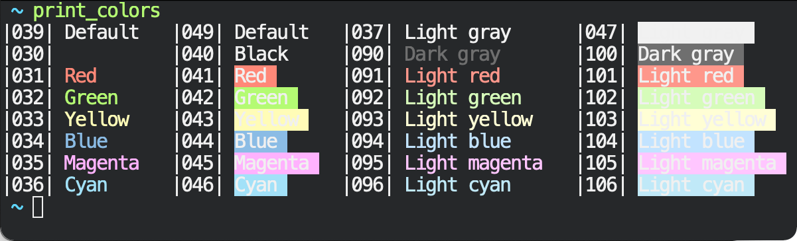             |
|   **_tango_dark_**<br>[source](https://github.com/GNOME/gnome-terminal/blob/18939a24d21d6b7c6edd57a00a3a8a48f3aecec5/src/profile-editor.c#L213)   |            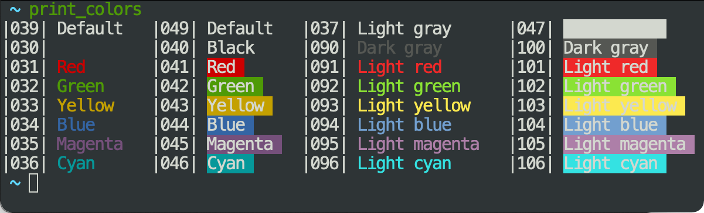            |
|                                      **_tender_**<br>[source](https://github.com/huyvohcmc/tender-alacritty)                                      |                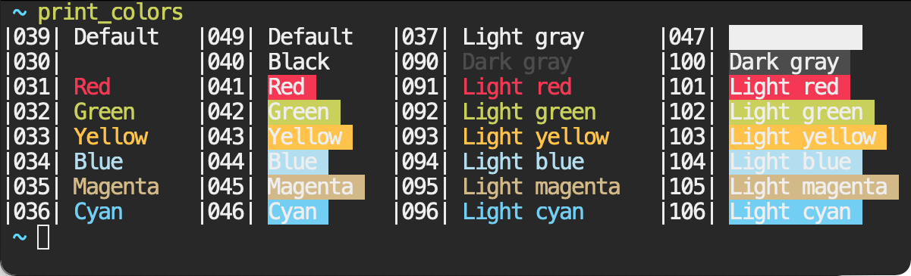                |
|                                                                **_terminal_app_**                                                                 |          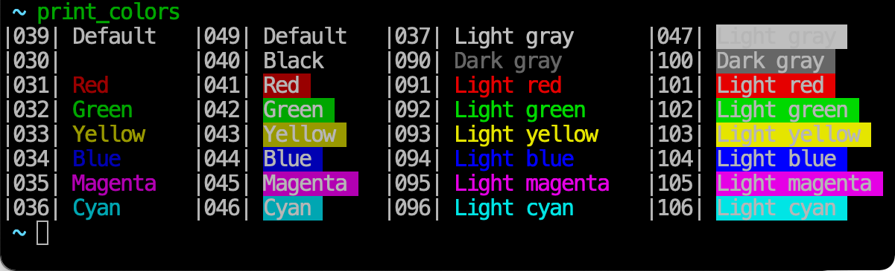          |
|                                                                 **_thelovelace_**                                                                 |          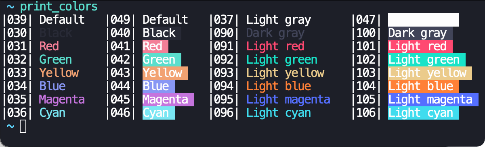           |
|                             **_tokyo-night_**<br>[source](https://github.com/zatchheems/tokyo-night-alacritty-theme)                              |           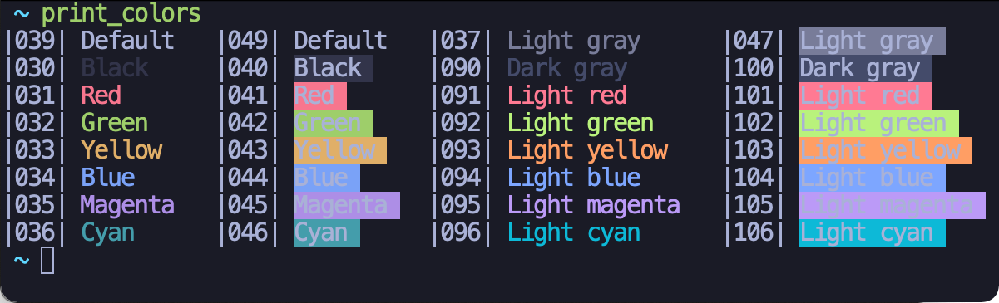           |
|                          **_tokyo-night-storm_**<br>[source](https://github.com/zatchheems/tokyo-night-alacritty-theme)                           |     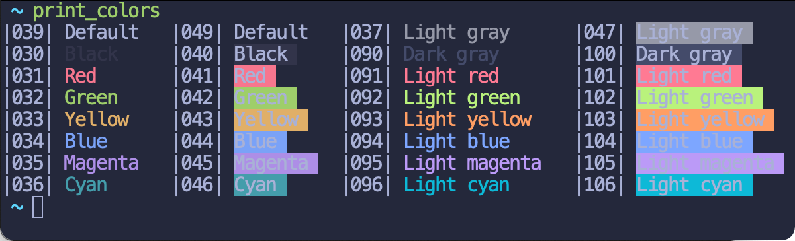     |
|                                 **_tomorrow_night_**<br>[source](https://github.com/ChrisKempson/Tomorrow-Theme)                                  |        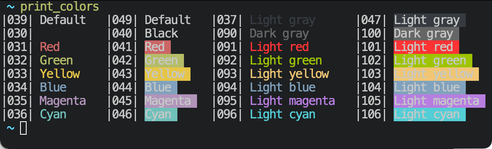        |
|                              **_tomorrow_night_bright_**<br>[source](https://github.com/ChrisKempson/Tomorrow-Theme)                              | 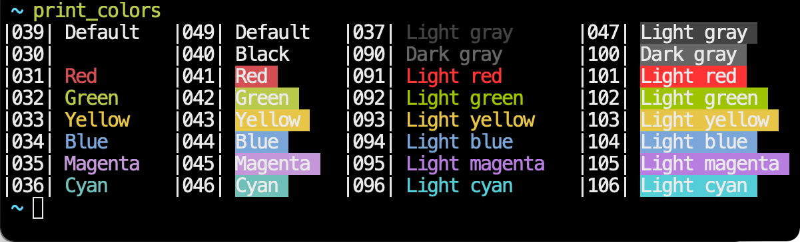 |
|                                     **_ubuntu_**<br>[source](https://design.ubuntu.com/brand/colour-palette/)                                     |                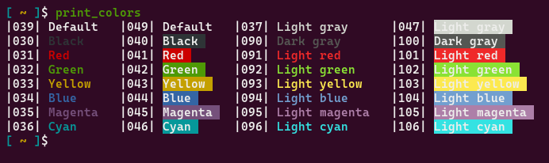                |
|                                        **_wombat_**<br>[source](https://github.com/djoyner/iTerm2-wombat)                                         |                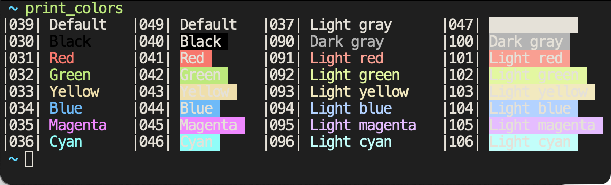                |
|                                                                    **_xterm_**                                                                    |                 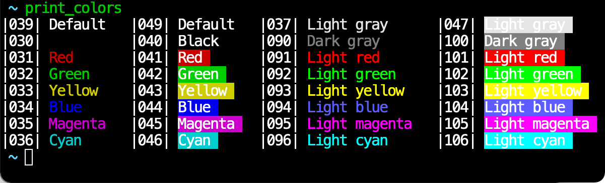                 |
|                                          **_zenburn_**<br>[source](https://github.com/jnurmine/Zenburn)                                           |               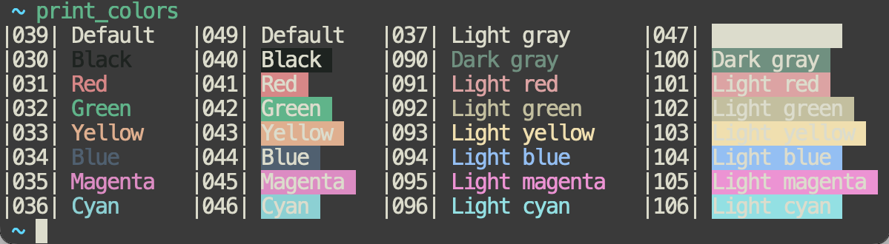               |

## Contributing

Bug reports and pull requests are welcome on GitHub at the [alacritty-theme]
repository.

[alacritty-theme]: https://github.com/alacritty/alacritty-theme

To add a new theme, just create a Pull Request with the following changes:

 - Add your theme to the `themes/{variant}` directory with the `{theme}.yaml` file format
 - Create a screenshot of your theme using the [`print_colors.sh`](./print_colors.sh) script
 - Add the screenshot to the `images/{variant}/` directory with the `{theme}.png` file format
 - Add your theme to the `schemes.yaml`
 - Add your theme to the `README.md`, following alphabetical ordering

## Maintainers

 * **indrajit** - *Author* - [eendroroy](https://github.com/eendroroy)
 * **Christian Dürr** - *Maintainer* - [chrisduerr](https://github.com/chrisduerr)

## License

The project is available as open source under the terms of the [Apache License, Version 2.0](LICENSE)
